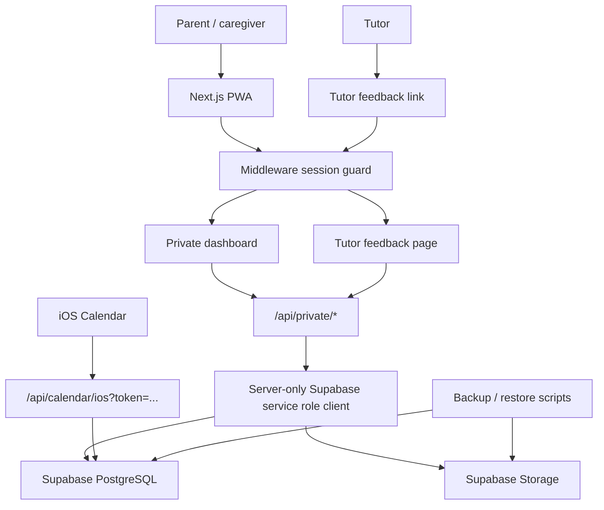

# Family Education Management System


Private family education operations workspace for a three-child household. Built with Next.js 15, TypeScript, TailwindCSS, Supabase PostgreSQL, and Supabase Storage. Netlify is the primary production host; Vercel is retained only as a fallback deployment target.

This repository is the private custom family version. It is intentionally separate from the future public/commercial product track.

## Status

Production is live:

- App: [bzs-family-edu.netlify.app](https://bzs-family-edu.netlify.app/)
- Repository: [moirakk/family-education-private-three-child](https://github.com/moirakk/family-education-private-three-child)
- Hosting: Netlify Free, deployed automatically from `main`
- Current access model: parent workspace opens by private link on trusted devices; tutor feedback uses a code-bearing link.
- Disaster recovery: one full backup -> fresh Supabase restore rehearsal has been completed.

Quality gates used before deployment:

```bash
npm run typecheck
npm run lint
npm run test
npm run build
```

## Product Scope

The product helps parents run daily and long-term education operations across multiple children:

- daily command center
- weekly calendar and iOS Calendar sync
- school, tutoring, activity, exam, and family events
- child profiles and school information
- learning records
- learning materials and file uploads
- child self-evaluation
- tutor feedback
- education goals and milestones
- export, backup, restore, and Obsidian archive workflows

The current workspace is customized for three children, while the database model still keeps `family_id`, child relationships, and role boundaries explicit so future SaaS extraction remains possible.

## App Information Architecture

The app is organized around parent tasks, not feature demos.

| Mode | Daily intent | Main modules |
| --- | --- | --- |
| Today | Decide what needs attention now | daily brief, next actions, urgent events |
| Week | Plan and review the week | event planner, weekly overview, calendar, iOS sync |
| Records | Capture learning evidence | learning records, materials, tutor feedback, self-evaluation, archives |
| Settings | Maintain the system | share links, exports, PWA install, intake data |

Mobile uses a bottom tab bar. Desktop uses a left sidebar. Low-frequency modules are folded so the family does not have to scroll through an admin console every day.

## Architecture



## Security Model

This private version uses a lightweight no-login model designed for a trusted family deployment:

- Parent workspace can run in `PRIVATE_PARENT_ACCESS_MODE=open` for trusted-device PWA use.
- Tutor access stays limited to `/tutor-feedback?code=...`.
- Successful access issues a signed `httpOnly` cookie.
- Cookies use `Secure` and `SameSite=Strict`.
- Middleware guards private pages and `/api/private/*`.
- Private API writes validate family and child ownership in application code.
- Supabase service role key is server-only and protected by `server-only`.
- The iOS calendar feed requires either a valid calendar token or a signed private session.
- The service worker does not cache private API responses or HTML documents.

Known limitation:

- Access-code rate limiting is still best-effort/in-process. If parent access is switched back to code mode for broader sharing, move rate limiting to a shared store such as Upstash Redis.

## Data Storage

Long-term data lives in Supabase.

PostgreSQL stores:

- family settings
- children and intake profiles
- calendar events and event-child links
- learning records
- education goals and milestones
- resource metadata
- learning material metadata
- self-evaluations
- tutor feedback

Supabase Storage stores uploaded learning materials. The database stores metadata plus `storage_path`; file bodies live in the private `learning-materials` bucket.

## Repository Structure

```text
.
├── .github/
│   ├── pull_request_template.md
│   └── workflows/ci.yml
├── docs/
│   ├── README.md
│   ├── private-core-architecture.md
│   ├── private-product-code-map.md
│   ├── private-supabase-schema.sql
│   ├── private-supabase-storage.sql
│   ├── private-supabase-vercel-runbook.md
│   └── private-pwa-deployment-guide.md
├── public/
│   ├── offline.html
│   └── sw.js
├── scripts/
│   ├── private-backup-all.mjs
│   ├── private-backup-storage.mjs
│   ├── private-check-env.mjs
│   ├── private-export-obsidian.mjs
│   ├── private-restore-backup.mjs
│   ├── private-restore-storage.mjs
│   └── private-smoke-test.mjs
├── src/
│   ├── app/
│   │   ├── api/
│   │   ├── access/
│   │   ├── tutor-feedback/
│   │   ├── layout.tsx
│   │   └── page.tsx
│   ├── components/
│   │   ├── dashboard/
│   │   ├── system/
│   │   └── ui/
│   ├── lib/
│   └── middleware.ts
├── ROADMAP.md
├── .env.example
├── .nvmrc
└── package.json
```

See [docs/README.md](docs/README.md) for the full documentation map.

Repository governance:

- [CHANGELOG.md](CHANGELOG.md) records major product and operations changes.
- [SECURITY.md](SECURITY.md) defines private-data and credential-handling rules.
- GitHub issues and pull requests include privacy and verification checklists.

## Local Development

Use Node 22:

```bash
nvm use
npm install
npm run dev
```

Open:

```text
http://127.0.0.1:3000
```

Run the full local verification suite:

```bash
npm run typecheck
npm run lint
npm run test
npm run build
```

## Environment Variables

Copy `.env.example` to `.env.local`.

Required for private Supabase mode:

```bash
NEXT_PUBLIC_FAMILY_DATA_MODE="private-api"
NEXT_PUBLIC_PRIVATE_FAMILY_ID="family-uuid"
NEXT_PUBLIC_SUPABASE_URL="https://your-project.supabase.co"
NEXT_PUBLIC_SUPABASE_ANON_KEY="publishable-or-anon-key"
SUPABASE_SERVICE_ROLE_KEY="server-only-service-role-key"
PRIVATE_SESSION_SECRET="long-random-session-secret"
SUPABASE_LEARNING_MATERIALS_BUCKET="learning-materials"
```

Access mode:

```bash
PRIVATE_PARENT_ACCESS_MODE="open" # trusted-device private deployment
PRIVATE_PARENT_ACCESS_CODE="fallback-parent-code"
PRIVATE_TUTOR_ACCESS_CODE="tutor-code"
```

Never commit `.env.local`, Supabase service keys, access codes, or calendar tokens.

## Supabase Setup

Run these SQL files in a Supabase project:

```text
docs/private-supabase-schema.sql
docs/private-supabase-storage.sql
docs/private-pilot-seed-template.sql
```

Then configure the same project values in Vercel environment variables and redeploy.

## Backup And Restore

Create a full backup:

```bash
npm run private:backup -- --out ./private-backups/latest
```

The backup script uses `PRIVATE_PARENT_ACCESS_CODE` when present. In the current trusted-device `PRIVATE_PARENT_ACCESS_MODE=open` deployment, it can also obtain a parent session by visiting the app root.

This creates:

- `database-export.json`
- `storage/storage-manifest.json`
- `storage/files/**`
- `backup-manifest.json`

Dry-run restore:

```bash
npm run private:restore -- \
  --file ./private-backups/latest/database-export.json \
  --storage-manifest ./private-backups/latest/storage/storage-manifest.json \
  --dry-run

npm run private:restore-storage -- --dir ./private-backups/latest/storage --dry-run
```

Production recovery should always be rehearsed in a fresh Supabase project before trusting the backup path.

## iOS Calendar Sync

The app exposes a one-way ICS feed:

```text
/api/calendar/ios?token=<family_settings.calendar_token>
```

iOS Calendar should subscribe through `webcal://`. Edits should happen inside the web app and flow out to iOS Calendar. Two-way CalDAV sync is intentionally out of scope for this private MVP.

## Obsidian Export

Generate an Obsidian-compatible archive from a database export:

```bash
npm run private:obsidian -- \
  --file ./private-backups/latest/database-export.json \
  --out ./Family-Education-Vault
```

Obsidian is useful for long-term reading, search, and archive review. It is not the source of truth for live schedules.

## Deployment

Primary production deployment:

```text
https://bzs-family-edu.netlify.app
```

Netlify is connected to the private GitHub repository and automatically deploys `main`. The production build uses `npm run build`, Node.js 22, and the environment variables documented in [docs/private-production-runbook.md](docs/private-production-runbook.md).

Vercel remains an optional fallback host. A manual fallback deploy can be created with:

```bash
npx vercel --prod --yes
```

Do not hand a fallback URL to parents unless it has passed the same mobile acceptance checklist as the primary Netlify URL.

## Quality Checklist

Before sharing with parents:

- local checks pass
- GitHub Actions CI is green
- production build succeeds
- `/api/health` responds
- parent PWA opens on iPhone
- tutor link only opens tutor feedback
- iOS Calendar subscription works
- export works
- latest backup can dry-run restore
- no secrets are committed

## Roadmap

See [ROADMAP.md](ROADMAP.md).

Near-term focus:

- complete the real iPhone production acceptance checklist
- real-material upload and reopen verification
- scheduled backup automation
- two-week real-use observation before further UI changes
- stronger shared rate limiting if parent mode changes from open to code

Commercial track remains separate and should not be mixed into this private deployment until multi-tenant auth, RLS, audit logs, and billing are intentionally designed.

## Privacy Notice

This repository may contain private family workflow assumptions and operational notes. Keep it private. Do not make it public without removing private context, seed data, access patterns, and family-specific documentation.
