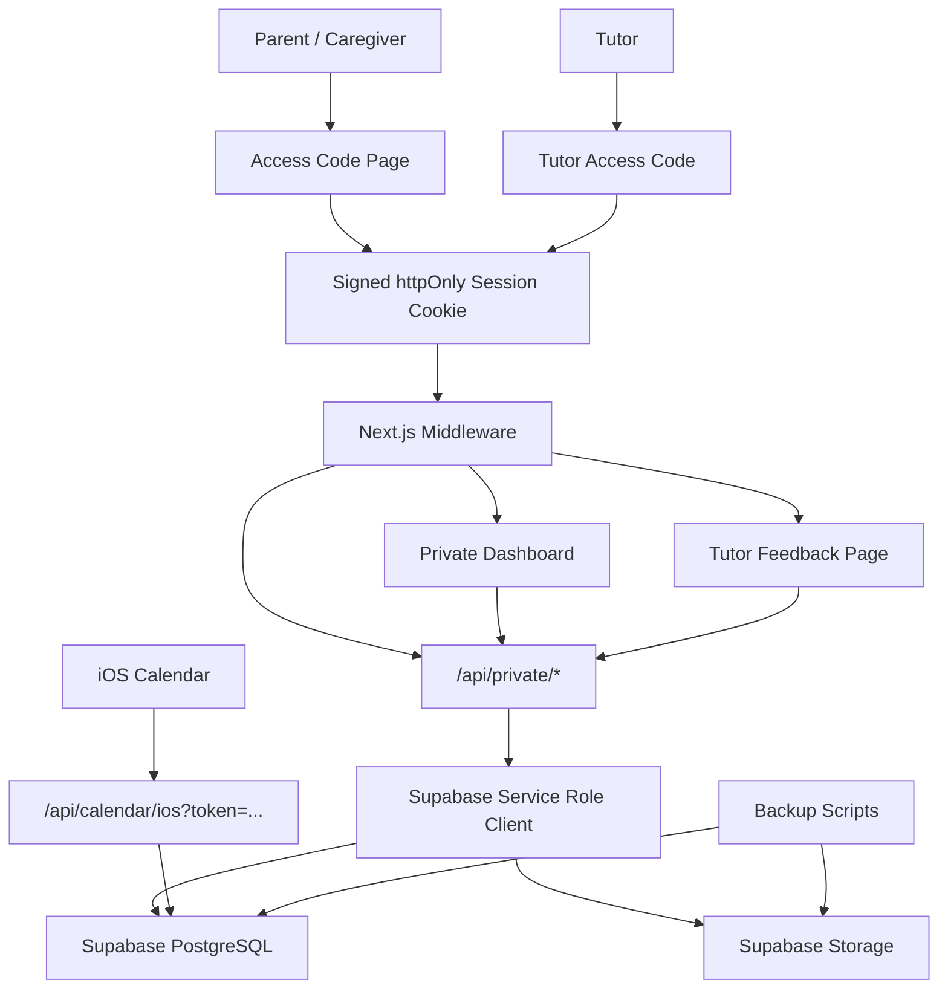

# Family Education Management System

Private three-child education operations workspace built with Next.js, TypeScript, Supabase, PostgreSQL, and Vercel.

This repository contains the private custom version for one family. It is intentionally separate from the future public/commercial product track.

## Product Purpose

Family Education Management System helps parents manage the daily and long-term education operations of a multi-child household:

- school schedules
- tutoring sessions
- extracurricular activities
- exams and deadlines
- learning records
- study materials and files
- self-evaluations
- tutor feedback
- education goals and milestones
- iOS Calendar subscriptions
- backup and restore workflows

The current private workspace is designed around a three-child family, but the data model keeps `family_id` and child relationships explicit so the system can evolve into a commercial multi-family SaaS later.

## Current Status

The private MVP is beyond static demo state. It now supports real Supabase-backed workflows for the core modules.

Implemented:

- access-code protected private workspace
- parent/caregiver dashboard access
- limited tutor feedback entry flow
- Supabase PostgreSQL schema for private family data
- Supabase Storage integration for learning materials
- child CRUD with deletion protection
- calendar event CRUD
- learning record CRUD
- education roadmap CRUD
- learning materials metadata and file upload
- self-evaluation CRUD
- tutor feedback CRUD
- private JSON export
- Storage backup and restore scripts
- iOS Calendar ICS/webcal endpoint
- PWA manifest, service worker, icons, and offline page
- mobile four-mode app shell: Today, Week, Records, More
- production smoke test script
- production security hardening for signed sessions, private API boundaries, calendar token handling, and health output

Production status:

- Vercel production deployment is live
- Production URL: `https://family-education-private-three-chil.vercel.app`
- Private smoke test passed against production
- real iPhone PWA installation has been verified
- iOS Calendar feed works through the private calendar token

Still in progress:

- scheduled backups
- stronger cross-instance access-code rate limiting
- mobile form simplification
- polished UI pass for daily parent use

## Product Modes

The dashboard is organized around parent tasks rather than feature showcase sections.

| Mode | Purpose |
| --- | --- |
| Today | First-screen command center for urgent tasks, upcoming items, quick actions, and child summaries |
| Week | Calendar planning, weekly overview, event editing, iOS sync |
| Records | Learning records, materials, self-evaluations, tutor feedback, child profiles, growth tracking |
| More | Intake notes, export preview, handoff plan, PWA install, deployment status |

On desktop, modes are switched from a left sidebar. On mobile, they are switched from a fixed bottom tab bar.

## Architecture



## Security Model

This private version uses a lightweight no-login model:

- access code verifies role
- successful login issues a signed `httpOnly` session cookie
- cookies use `SameSite=Strict`
- parent/caregiver can access the full dashboard
- tutor can only access `/tutor-feedback` and limited private endpoints
- viewer role is defined but not productized for the dashboard
- Supabase service role key is server-only
- `src/lib/supabase-admin.ts` imports `server-only`
- private API writes verify `family_id` and child ownership
- middleware returns JSON 403 for private API rejections
- `/api/health` returns only `{ ok: true }` publicly and detailed checks only after private login
- `/api/calendar/ios` requires either a valid calendar token or a signed private session in private production mode
- service worker does not cache private API responses

Important limitation:

The access-code rate limit is currently cookie + best-effort in-memory protection. For Vercel multi-instance production hardening, use a shared rate-limit store such as Upstash Redis.

## Data Storage

Long-term family data lives in Supabase.

PostgreSQL stores:

- family workspace settings
- children
- child intake profiles
- calendar events
- event-child relationships
- learning records
- education goals
- milestones
- resources
- learning material metadata
- self-evaluations
- tutor feedback

Supabase Storage stores:

- uploaded worksheets
- files
- notes exported as files
- other learning materials

The database stores file metadata and `storage_path`; file bodies live in a private Supabase Storage bucket.

## iOS Calendar Sync

The app exposes a one-way ICS feed:

```text
/api/calendar/ios?token=<family_settings.calendar_token>
```

Parents can subscribe from iOS Calendar using `webcal://`.

This is intentionally one-way. Edits should happen in the web app, then flow into iOS Calendar. Full CalDAV two-way sync is out of scope for this private MVP.

In private production mode, the calendar endpoint no longer falls back to demo data when no token is provided. Token-based calendar access is validated server-side with Supabase service role access.

## Repository Structure

```text
.
├── docs/
│   ├── claude-current-review-2026-06-23.md
│   ├── private-current-status-for-claude.md
│   ├── private-pwa-deployment-guide.md
│   ├── private-supabase-schema.sql
│   ├── private-supabase-storage.sql
│   ├── private-supabase-vercel-runbook.md
│   └── private-three-child-debug-brief.md
├── public/
│   ├── offline.html
│   └── sw.js
├── scripts/
│   ├── private-backup-storage.mjs
│   ├── private-check-env.mjs
│   ├── private-generate-secrets.mjs
│   ├── private-restore-backup.mjs
│   ├── private-restore-storage.mjs
│   └── private-smoke-test.mjs
├── src/
│   ├── app/
│   │   ├── api/
│   │   │   ├── access/
│   │   │   ├── calendar/ios/
│   │   │   ├── health/
│   │   │   └── private/
│   │   ├── access/
│   │   ├── tutor-feedback/
│   │   ├── layout.tsx
│   │   └── page.tsx
│   ├── components/
│   │   ├── dashboard/
│   │   └── ui/
│   ├── lib/
│   │   ├── child-theme.ts
│   │   ├── private-access.ts
│   │   ├── supabase-admin.ts
│   │   ├── urgency.ts
│   │   └── types.ts
│   └── middleware.ts
├── .env.example
├── .nvmrc
├── package.json
└── README.md
```

## Environment Variables

Create `.env.local` from `.env.example`.

Required for private Supabase mode:

```bash
NEXT_PUBLIC_FAMILY_DATA_MODE="private-api"
NEXT_PUBLIC_PRIVATE_FAMILY_ID="family-uuid"
NEXT_PUBLIC_SUPABASE_URL="https://your-project.supabase.co"
NEXT_PUBLIC_SUPABASE_ANON_KEY="publishable-or-anon-key"
SUPABASE_SERVICE_ROLE_KEY="server-only-service-role-key"
PRIVATE_PARENT_ACCESS_CODE="parent-access-code"
PRIVATE_SESSION_SECRET="long-random-session-secret"
SUPABASE_LEARNING_MATERIALS_BUCKET="learning-materials"
```

Optional:

```bash
PRIVATE_CAREGIVER_ACCESS_CODE="caregiver-access-code"
PRIVATE_TUTOR_ACCESS_CODE="tutor-access-code"
PRIVATE_VIEWER_ACCESS_CODE="viewer-access-code"
```

Never commit `.env.local`.

## Local Development

Use Node 22:

```bash
nvm use
```

Install dependencies:

```bash
npm install
```

Run development server:

```bash
npm run dev
```

Run production build:

```bash
npm run build
```

Run checks:

```bash
npm run typecheck
npm run lint
```

## Private Smoke Test

After starting the app:

```bash
npm run start
npm run private:smoke -- --base-url http://127.0.0.1:3000 --expect-ready --deep-private
```

The smoke test checks:

- `/api/health`
- access page
- PWA manifest
- icons
- service worker
- offline page
- private access login
- unauthenticated API rejection
- protected dashboard
- tutor access boundaries
- iOS calendar feed
- private export

## Backup And Restore

Create a full private backup:

```bash
npm run private:backup -- --out ./private-backups/latest
```

This creates:

- `database-export.json`
- `storage/storage-manifest.json`
- `storage/files/**`
- `backup-manifest.json`

The backup manifest includes dry-run restore commands.

Database export is also available from:

```text
/api/private/export
```

Storage-only backup:

```bash
npm run private:backup-storage -- --out ./private-storage-backup
```

Database restore dry run:

```bash
npm run private:restore -- \
  --file ./private-backups/latest/database-export.json \
  --storage-manifest ./private-backups/latest/storage/storage-manifest.json \
  --dry-run
```

Storage restore dry run:

```bash
npm run private:restore-storage -- --dir ./private-backups/latest/storage --dry-run
```

Database restore:

```bash
npm run private:restore -- --file ./backup.json
```

Database restore with Storage manifest verification:

```bash
npm run private:restore -- --file ./backup.json --storage-manifest ./private-storage-backup/storage-manifest.json
```

Storage restore:

```bash
npm run private:restore-storage -- --dir ./private-storage-backup
```

Before trusting backups for long-term use, restore into a fresh Supabase project and verify signed downloads from the app.

## Obsidian Export

Generate an Obsidian-compatible Markdown vault from a database export:

```bash
npm run private:obsidian -- \
  --file ./private-backups/latest/database-export.json \
  --out ./Family-Education-Vault
```

The vault includes:

- `00 Dashboard.md`
- child profile pages
- unified calendar page
- learning records page
- materials index
- education roadmap
- self-evaluations
- tutor feedback
- export metadata

Obsidian is recommended for long-term reading, search, and archive review. iOS reminders should still use the app's webcal calendar subscription.

## Deployment Plan

1. Keep this repository private.
2. Import this repository into Vercel.
3. Add all required environment variables in Vercel.
4. Run `docs/private-supabase-schema.sql` in Supabase.
5. Run `docs/private-supabase-storage.sql` in Supabase.
6. Redeploy after environment variable changes.
7. Open `/api/health` and confirm `ready=ok`.
8. Run the private smoke test against the Vercel URL.
9. Install the PWA on a real iPhone.
10. Subscribe to the iOS Calendar feed using the real production `webcal://` URL.

## Quality Gates

Before giving the production URL to parents:

- `npm run typecheck`
- `npm run lint`
- `npm run build`
- private smoke test passes
- Supabase tables exist
- Storage bucket exists
- parent access code works
- tutor access code only opens tutor flow
- export works
- backup scripts run
- iPhone PWA install works
- iOS Calendar subscription works

## Product Roadmap

Private version priorities:

1. iPhone PWA and Calendar verification
2. daily parent workflow polish
3. mobile quick-entry forms
4. scheduled backup automation
5. stronger rate limiting
6. family handoff guide

Commercial version later:

1. Supabase Auth
2. multi-family tenancy
3. formal roles and invitations
4. row-level security
5. audit logs
6. billing
7. generalized onboarding

## Important Notes

This repository may contain private family workflow assumptions. Do not make it public without removing private context, seed data, and operational notes.

Supabase keys, access codes, and calendar tokens must stay in local/Vercel environment variables only.
