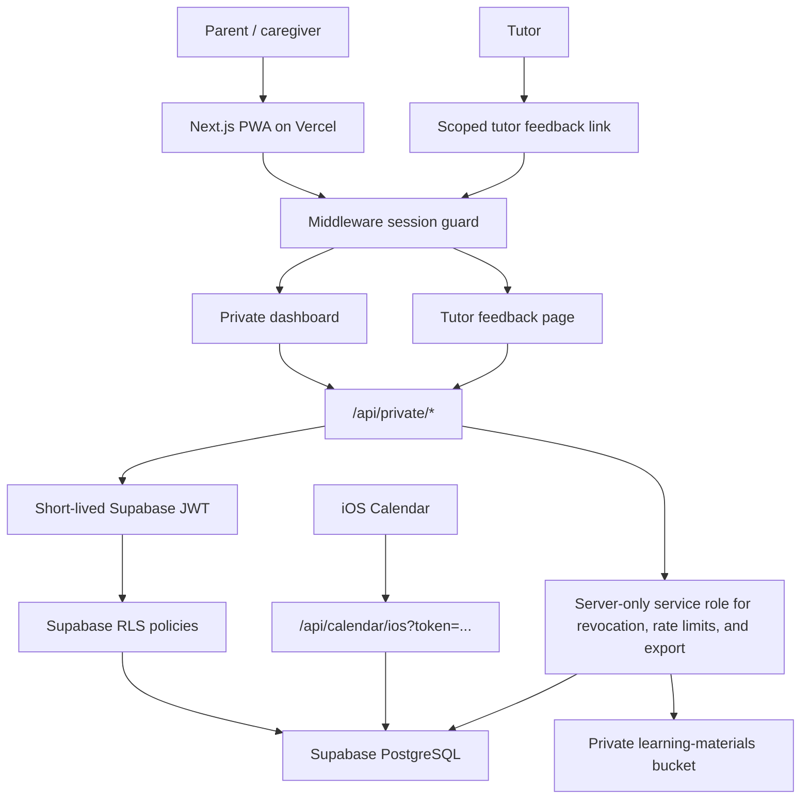

# Family Education Management System


Private three-child family education operations workspace. Built with Next.js 15, React 19, TypeScript, Tailwind CSS, Supabase PostgreSQL, Supabase Storage, and Vercel.

This repository is the private custom family version. It is intentionally separate from any future public or commercial product track.

## Status

Production is live:

- App: [family-education-private-three-chil.vercel.app](https://family-education-private-three-chil.vercel.app/)
- Repository: [moirakk/family-education-private-three-child](https://github.com/moirakk/family-education-private-three-child)
- Hosting: Vercel Production, deployed from this repository
- Database: Supabase project in `ap-northeast-1`
- Data mode: `private-api`

Latest production verification:

- `/` redirects unauthenticated users to `/access`
- `/api/health` returns `{"ok":true}`
- authenticated `/api/private/snapshot` reads the live Supabase data
- current seed data includes 3 children, 5 calendar events, 3 education goals, and 4 resources

## Product Scope

The app helps parents manage daily and long-term education operations:

- daily command center
- schedule planning and iOS Calendar subscription
- school, tutoring, activity, exam, and family events
- grade settings for three children
- learning records and exports
- tutor feedback
- exam, competition, and school growth plans
- backup, restore, and archive workflows

The database keeps `family_id`, child relationships, scoped tutor access, and RLS boundaries explicit so future SaaS extraction remains possible.

## App Information Architecture

| Mode | Daily intent | Main modules |
| --- | --- | --- |
| Today | Decide what needs attention now | daily brief, next actions, urgent events |
| Schedule | Plan dates and recurring commitments | event planner, unified calendar, iOS sync |
| Records | Capture outcomes and plans | learning records, tutor feedback, growth plans |
| Settings | Maintain the system | share links, exports, grade settings, PWA install |

Mobile uses a bottom tab bar. Desktop uses a left sidebar. Low-frequency tools stay in Settings so daily use does not feel like an admin console.

## Architecture



## Security Model

- Access is code-based through `/access`; parent and caregiver roles can open the full dashboard.
- Tutor access is limited to signed invitation links scoped to one child, tutor, and subject.
- Successful access issues a signed `httpOnly`, `SameSite=Strict` cookie.
- Session and invite tokens can be revoked through the `revoked_tokens` table.
- Failed access attempts are rate-limited through the `access_attempts` table.
- Private API payloads are validated with Zod schemas.
- Supabase writes use short-lived request-scoped JWTs and are enforced by RLS.
- The service-role key is server-only and must never be exposed to browser code.
- The iOS calendar feed requires a valid calendar token.
- The service worker does not cache private API responses or HTML documents.

## Data Storage

Supabase PostgreSQL stores:

- family settings
- children
- calendar events and event-child links
- learning records
- education goals and milestones
- resource metadata
- learning material metadata
- tutor feedback
- token revocation and access attempt records

Supabase Storage stores uploaded learning materials in the private `learning-materials` bucket.

## Repository Structure

```text
.
├── .github/
│   └── workflows/ci.yml
├── docs/
│   ├── README.md
│   ├── deployment-guide.md
│   ├── private-production-runbook.md
│   ├── private-supabase-schema.sql
│   ├── private-supabase-storage.sql
│   ├── supabase-inventory-check.sql
│   └── archive/
├── public/
│   ├── offline.html
│   └── sw.js
├── scripts/
│   ├── private-backup-all.mjs
│   ├── private-check-env.mjs
│   ├── private-generate-secrets.mjs
│   ├── private-restore-backup.mjs
│   └── private-smoke-test.mjs
├── src/
│   ├── app/
│   ├── components/
│   ├── hooks/
│   ├── lib/
│   └── middleware.ts
├── tests/
├── .env.example
├── .nvmrc
└── package.json
```

See [docs/README.md](docs/README.md) for the documentation map.

## Local Development

Use Node 22:

```bash
nvm use
npm install
npm run dev
```

Open:

```text
http://127.0.0.1:3000
```

Run the full verification suite:

```bash
npm run typecheck
npm run lint
npm run test
npm run build
```

## Environment Variables

Copy `.env.example` to `.env.local`.

Required for `private-api` mode:

```bash
NEXT_PUBLIC_FAMILY_DATA_MODE="private-api"
NEXT_PUBLIC_PRIVATE_FAMILY_ID="family-uuid"
NEXT_PUBLIC_SUPABASE_URL="https://your-project.supabase.co"
NEXT_PUBLIC_SUPABASE_ANON_KEY="publishable-or-anon-key"
SUPABASE_SERVICE_ROLE_KEY="server-only-service-role-key"
SUPABASE_JWT_SECRET="server-only-supabase-jwt-secret"
PRIVATE_SESSION_SECRET="long-random-session-secret"
PRIVATE_PARENT_ACCESS_CODE="parent-access-code"
SUPABASE_LEARNING_MATERIALS_BUCKET="learning-materials"
```

Optional role codes:

```bash
PRIVATE_CAREGIVER_ACCESS_CODE="caregiver-access-code"
PRIVATE_TUTOR_ACCESS_CODE="tutor-link-rotation-secret"
PRIVATE_VIEWER_ACCESS_CODE="viewer-access-code"
```

Production should not set `PRIVATE_PARENT_ACCESS_MODE=unsafe-open`.

Never commit `.env.local`, Supabase keys, access codes, session secrets, or calendar tokens.

## Supabase Setup

For a fresh project, follow [docs/deployment-guide.md](docs/deployment-guide.md). The core SQL artifacts are:

```text
docs/private-supabase-schema.sql
docs/migrations/2026-07-17-score-records.sql
docs/migrations/2026-07-17-growth-plans.sql
docs/migrations/2026-07-17-calendar-rules.sql
docs/migrations/2026-07-22-token-security.sql
docs/private-supabase-storage.sql
docs/private-pilot-seed-template.sql
```

Use [docs/supabase-inventory-check.sql](docs/supabase-inventory-check.sql) for read-only production audits.

## Backup And Restore

Create a full backup:

```bash
npm run private:backup -- --out ./private-backups/latest
```

This creates:

- `database-export.json`
- `storage/storage-manifest.json`
- `storage/files/**`
- `backup-manifest.json`

Dry-run restore:

```bash
npm run private:restore -- \
  --file ./private-backups/latest/database-export.json \
  --storage-manifest ./private-backups/latest/storage/storage-manifest.json \
  --dry-run

npm run private:restore-storage -- --dir ./private-backups/latest/storage --dry-run
```

Rehearse production recovery in a fresh Supabase project before trusting a restore path.

## Deployment

Production is hosted on Vercel:

```text
https://family-education-private-three-chil.vercel.app
```

Manual production deploy:

```bash
npx vercel --prod --yes
```

After deploying, verify:

```bash
curl -I https://family-education-private-three-chil.vercel.app/
curl -s https://family-education-private-three-chil.vercel.app/api/health
```

Use [docs/private-production-runbook.md](docs/private-production-runbook.md) for release, backup, and incident operations.

## Quality Checklist

Before sharing with family:

- local checks pass
- GitHub Actions CI is green
- Vercel production build succeeds
- `/api/health` responds
- parent PWA opens on iPhone
- tutor link only opens feedback for its assigned child and subject
- iOS Calendar subscription works
- export works
- latest backup can dry-run restore
- no secrets are committed

## Privacy Notice

This repository may contain private family workflow assumptions and operational notes. Keep it private. Do not make it public without removing private context, seed data, access patterns, and family-specific documentation.
