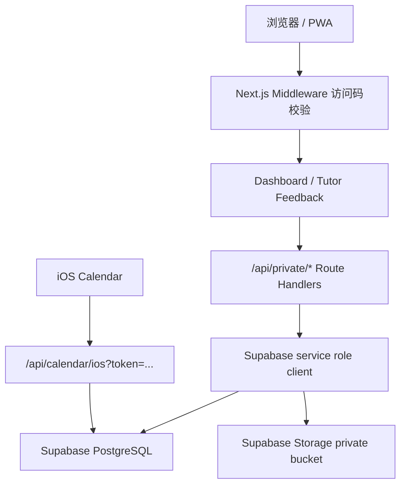

# Family Education Management System 私有三孩版 Debug Brief

> 用途：把当前“伯 / 仲 / 叔三孩私有版”的产品结构、工程结构、数据结构、访问控制、部署方式和已知风险集中给 Claude 或其他协作者分析。  
> 重要：这份文档可以外发给技术协作方，但不要把 `.env.local`、Supabase secret key、访问码、calendar token、真实学校/机构/联系方式贴进去。

## 1. 当前目标

本项目现在优先做“单个家庭长期可用的私有教育管理系统”，不是展示型 demo。

当前服务对象是三孩家庭：

| 孩子 | 阶段 | 产品阶段定义 | 当前真实数据状态 |
| --- | --- | --- | --- |
| 伯杨 | 马上升初一 | 小升初衔接期 | 学校、课表、考试、目标明细待家长补充 |
| 仲杨 | 马上升五年级 | 高年级准备期 | 学校、课表、考试、目标明细待家长补充 |
| 叔杨 | 马上升二年级 | 低年级习惯成型期 | 学校、课表、考试、目标明细待家长补充 |

产品分两条线：

1. 私有定制版：当前正在做；不公开 GitHub；访问码进入；Supabase 持久化；Vercel 私有部署；iOS Calendar 单向订阅。
2. 通用商业版：后续抽象；需要正式登录、多租户、家庭成员角色、审计、订阅计费。

当前判断：先把私有版跑通成长期可用工具，再抽象通用版。

## 2. 技术栈与运行方式

- Next.js 15 App Router
- React 19
- TypeScript
- TailwindCSS
- shadcn/ui 风格本地组件
- Supabase PostgreSQL
- Supabase Storage
- Vercel 目标部署
- iOS Calendar 通过 ICS / webcal 订阅
- Node 目标版本：22.x

主要命令：

```bash
npm install
npm run typecheck
npm run lint
npm run build
npm run start -- --hostname 127.0.0.1 --port 3000
npm run private:smoke -- --base-url http://127.0.0.1:3000 --expect-ready --deep-private
```

当前本地验证结果：

- TypeScript 通过
- ESLint 通过
- Next.js production build 通过
- 私有版 smoke test 通过
- 真实 Supabase 已接入本地 `.env.local`
- 浏览器实测桌面和手机无页面级横向滚动
- 访问码 cookie 使用 `HttpOnly + SameSite=Strict`
- 未登录访问私有 API 返回 `403`
- tutor 不能读取完整反馈列表或导出

## 3. 当前分支与隐私边界

当前私有版分支：

```text
main
```

最近关键提交：

```text
afb5356 Fix dashboard horizontal overflow
b6f8488 Load private env in operations scripts
dfa5a4e Avoid hosted storage object index setup
64afb7f Recognize pasted Supabase env placeholders
6da6ada Allow private seed without auth user
8e25fc7 Protect child profiles from unsafe deletion
b1b9b63 Add private deployment smoke test
581d126 Add private storage restore script
9e916b6 Harden private access sessions
2ff49fd Persist private education roadmap
b3622db Persist private child profiles
f297375 Add limited tutor feedback entry
```

隐私规则：

- 私有三孩版不要推到公开 GitHub。
- `.env.local` 不入库。
- Supabase secret key 只能在服务端使用。
- 通用版可以公开，但必须脱敏，不包含三孩家庭真实数据。
- 给 Claude 或其他工具分析时，不要粘贴密钥、访问码、token、真实学校或机构信息。

## 4. 产品模块结构

主页面入口：`src/app/page.tsx`

页面外壳：`src/components/dashboard/app-shell.tsx`

当前左侧导航按使用频率分组：

- 每天使用：总览、补资料、统一日历、学习记录、导出预览
- 记录沉淀：资料库、自我评价、家教反馈、孩子档案
- 长期规划：成长记录、教育路线、iOS 同步、部署状态、资源中心

核心组件：

| 模块 | 文件 | 说明 |
| --- | --- | --- |
| 首页工作台 | `today-command-center.tsx` | 家长每天打开后的主要入口 |
| 本周总览 | `weekly-overview.tsx` | 展示本周事项 |
| 即将发生 | `upcoming-events.tsx` | 近期日程队列 |
| 现场补资料 | `family-intake-workspace.tsx` | 明天见家长时补学校、课表、目标、关注点 |
| 新增日程 | `family-event-planner.tsx` | 家长录入学校、辅导、活动、考试、家庭事项 |
| 统一日历 | `unified-calendar.tsx` | 按 category 聚合事件 |
| iOS 同步 | `calendar-sync-card.tsx` | webcal / ICS 订阅说明 |
| 学习记录 | `learning-record-planner.tsx` | 学习内容、时长、成绩、信心值 |
| 资料库 | `learning-materials-vault.tsx` | 文件、链接、讲义、错题材料 |
| 自我评价 | `self-evaluation-board.tsx` | 孩子心情、投入、掌握、反思 |
| 家教反馈 | `tutor-feedback-board.tsx` | 家长工作台管理家教反馈 |
| 家教入口 | `src/app/tutor-feedback/page.tsx` | 家教轻量提交页面 |
| 孩子档案 | `child-profile.tsx`, `child-management.tsx` | 孩子资料、学校信息、兴趣、关注重点 |
| 成长摘要 | `growth-summary.tsx` | 学习记录和目标进展摘要 |
| 教育路线 | `education-roadmap.tsx` | 长期目标、里程碑、进度 |
| 导出预览 | `export-preview-center.tsx` | 周报、JSON、ICS 预览与下载 |
| 部署状态 | `deployment-status-card.tsx` | 本地/私有部署健康提示 |
| PWA 安装 | `pwa-install-card.tsx` | 添加到 iPhone 主屏幕说明 |

## 5. 页面信息架构

当前页面结构大致为：

```text
AppShell
└── page.tsx
    ├── Hero / 顶部标题
    ├── 指标卡片
    ├── TodayCommandCenter
    ├── FamilyIntakeWorkspace
    ├── FamilyEventPlanner
    ├── WeeklyOverview + UpcomingEvents
    ├── UnifiedCalendar + CalendarSyncCard
    ├── WeeklyFamilyReport
    ├── ExportPreviewCenter
    ├── ThreeChildOperatingMatrix
    ├── LearningRecordPlanner
    ├── LearningMaterialsVault
    ├── SelfEvaluationBoard + TutorFeedbackBoard
    ├── ChildProfile + ChildManagement
    ├── GrowthSummary + EducationRoadmap
    ├── ResourceCenter
    ├── ParentActionBoard + ParentHandoffPlan
    ├── DeploymentStatusCard
    └── PwaInstallCard
```

当前 UI 刚修过一个重要问题：

- 问题：页面级横向滚动导致左侧导航失效。
- 修复：
  - AppShell 桌面布局改成 `244px_minmax(0,1fr)`
  - 左侧栏 `sticky top-0 h-screen overflow-y-auto`
  - 主区域和卡片默认 `min-w-0`
  - 两栏 grid 统一用 `minmax(0,1fr)`
  - 全局 `html/body overflow-x: hidden`
- 实测：1536 桌面宽度、390 手机宽度均无页面级横向溢出。

## 6. 数据模式

当前前端支持不同数据模式：

```text
NEXT_PUBLIC_FAMILY_DATA_MODE=local        # 本地 / pilot 数据
NEXT_PUBLIC_FAMILY_DATA_MODE=private-api  # 当前私有长期版
NEXT_PUBLIC_FAMILY_DATA_MODE=supabase     # 未来商业版方向
```

当前私有版使用：

```text
NEXT_PUBLIC_FAMILY_DATA_MODE=private-api
```

数据流：



注意：

- 浏览器端不应该拿到 Supabase service role key。
- 写入数据库全部走服务端 `/api/private/*`。
- iOS Calendar 不依赖 cookie，必须用 token。
- 家教入口和家长工作台权限不同。

## 7. 私有访问控制

核心文件：

- `src/middleware.ts`
- `src/lib/private-access.ts`
- `src/app/access/page.tsx`
- `src/app/api/access/route.ts`

角色：

```text
parent
caregiver
tutor
viewer
```

当前权限：

| 角色 | Dashboard | 私有 API | 家教入口 | 日历 |
| --- | --- | --- | --- | --- |
| parent | 可进入 | 可读写 | 可进入 | cookie 或 token |
| caregiver | 可进入 | 可读写 | 可进入 | cookie 或 token |
| tutor | 不进完整 Dashboard | 仅 tutor-context / tutor-feedback | 可进入 | 不作为主路径 |
| viewer | 当前不进完整 Dashboard | 不写入 | 不作为主路径 | 需另行设计 |

会话方式：

- 访问码提交到 `/api/access`
- 服务端签发签名 cookie
- cookie 使用 `HttpOnly + SameSite=Strict`，并带过期时间
- `/api/access` 有浏览器 cookie 尝试次数限制和 IP/UA 内存级短窗口限制
- middleware 根据 cookie role 放行或重定向

当前用户看到 `/access` 是正常的，因为私有版启用了访问码保护。直接访问 `/api/access` 不应该作为页面入口。

限制说明：

- 当前 IP/UA 限流是私有版轻量防线，适合单家庭低流量场景。
- 如果未来公开暴露给更多家庭，应改成 Upstash Redis / Vercel KV 这类跨实例持久限流。

## 8. API 结构

| 路径 | 用途 | 当前状态 |
| --- | --- | --- |
| `GET /api/health` | 部署健康检查 | 已实现 |
| `POST /api/access` | 访问码登录 | 已实现 |
| `GET /api/calendar/ios` | ICS 日历订阅 | 已实现 |
| `GET /api/private/snapshot` | 拉取家庭完整快照 | 已实现 |
| `PUT/POST/DELETE /api/private/children` | 孩子档案 | 已实现，删除有保护 |
| `POST/PUT/DELETE /api/private/events` | 日程 | 已实现 |
| `POST/PUT/DELETE /api/private/learning-records` | 学习记录 | 已实现 |
| `POST/PUT/DELETE /api/private/materials` | 学习资料 | 已实现 |
| `POST/PUT/DELETE /api/private/self-evaluations` | 自评 | 已实现 |
| `POST/PUT/DELETE /api/private/tutor-feedback` | 家教反馈 | 已实现 |
| `GET /api/private/tutor-context` | 家教入口上下文 | 已实现，tutor 仅可读取提交表单所需孩子列表 |
| `POST/PUT/DELETE /api/private/roadmap` | 教育目标和里程碑 | 已实现 |
| `PUT /api/private/intake` | 家长现场补资料 | 已实现 |
| `GET /api/private/export` | JSON 导出 | 已实现 |

协作 debug 时优先检查：

- route handler 是否只在服务端使用 service role
- 输入校验是否覆盖空值和类型
- PUT/DELETE 是否完整
- 删除保护是否覆盖所有关联表
- tutor API 是否泄露过多上下文

## 9. Supabase 数据库结构

schema 文件：

- `docs/private-supabase-schema.sql`
- `docs/private-supabase-storage.sql`
- `docs/private-pilot-seed-template.sql`

核心表：

```text
families
family_settings
family_members
children
child_intake_profiles
calendar_events
calendar_event_children
learning_records
education_goals
milestones
resources
learning_materials
self_evaluations
tutor_feedback
```

关键设计：

- 所有长期实体围绕 `family_id`
- UUID 主键
- `created_at` / `updated_at`
- Postgres enum：
  - `family_role`
  - `event_category`
  - `roadmap_status`
  - `resource_kind`
  - `event_source`
- 日程约束：`ends_at > starts_at`
- 学习分数约束：0-100
- 信心值 / 评分约束：1-5
- `family_settings.calendar_token` 唯一，长度至少 32
- 资料和文件元数据分离，文件本体走 Storage

当前真实 Supabase 状态：

- 本地 `.env.local` 已接入真实 Supabase 项目。
- 初始化 SQL 已成功执行。
- `private:smoke --deep-private` 已通过。
- Storage bucket 可连接；当前文件数量可能为 0，取决于是否已上传。
- 不要在文档或聊天中贴 service role key。

## 10. 文件存储与备份恢复

文件模块：

- 元数据表：`learning_materials`
- 文件本体：Supabase Storage private bucket
- 下载：短期 signed URL

备份脚本：

```bash
npm run private:backup-storage -- --out ./family-education-storage-backup
npm run private:restore-storage -- --dir ./family-education-storage-backup --dry-run
npm run private:restore -- --file ./backup.json --dry-run
npm run private:restore -- --file ./backup.json
```

导出接口：

```text
GET /api/private/export
```

当前备份策略判断：

- JSON 导出覆盖数据库 metadata。
- Storage 备份脚本覆盖文件本体。
- 真正上线前应完整演练一次：导出 JSON + 下载 Storage 文件 -> 全新 Supabase 项目恢复。

## 11. iOS Calendar / PWA

iOS Calendar：

```text
/api/calendar/ios?token=<calendar_token>
webcal://<host>/api/calendar/ios?token=<calendar_token>
```

当前策略：

- 单向订阅，适合私用版。
- 不做 CalDAV，除非未来需要从 iOS 日历反向同步编辑。
- token 泄露后需要轮换 `family_settings.calendar_token`。

PWA：

- `src/app/manifest.ts`
- `src/app/icon.tsx`
- `src/app/apple-icon.tsx`
- `public/sw.js`
- `public/offline.html`

注意：

- Service worker 采用 allowlist 缓存：只缓存离线页、manifest、图标和 `_next/static` 静态资源。
- `/api/*`、`/access`、`/tutor-feedback` 和动态页面不进入 Cache Storage。
- 家长最佳使用方式是私有链接 + 添加到 iPhone 主屏幕。

## 12. 当前工程目录速览

```text
docs/
  private-three-child-debug-brief.md      # 本文档
  private-current-status-for-claude.md    # 旧版状态文档，可参考但部分状态需更新
  private-core-architecture.md            # 私有版核心架构
  private-three-child-requirements.md     # 三孩版需求对齐
  private-supabase-schema.sql             # Supabase schema
  private-supabase-storage.sql            # Storage setup
  private-pilot-seed-template.sql         # seed 模板
  private-supabase-vercel-runbook.md      # Supabase/Vercel 操作手册
  today-delivery-runbook.md               # 当天交付操作手册

scripts/
  private-env.mjs                         # 自动加载 .env.local
  private-check-env.mjs                   # 环境变量检查
  private-generate-secrets.mjs            # 生成访问码/token
  private-smoke-test.mjs                  # 私有部署 smoke test
  private-backup-storage.mjs              # 下载 Storage 文件备份
  private-restore-storage.mjs             # 恢复 Storage 文件
  private-restore-backup.mjs              # 恢复数据库 JSON

src/app/
  page.tsx                                # 主 Dashboard
  access/page.tsx                         # 访问码页面
  tutor-feedback/page.tsx                 # 家教提交入口
  api/private/*                           # 私有写入/读取 API
  api/calendar/ios/route.ts               # ICS feed
  api/health/route.ts                     # 健康检查

src/lib/
  private-access.ts                       # 访问码、签名 session
  private-api-client.ts                   # 前端调用 private API
  supabase-admin.ts                       # 服务端 Supabase admin client
  supabase-family-repository.ts           # Supabase repository
  supabase-calendar-feed.ts               # 日历 feed 数据
  ics.ts                                  # ICS 生成
  pilot-data.ts                           # 当前 pilot 数据
  types.ts / core-types.ts                # 类型定义
```

## 13. 当前已知风险与 Debug 优先级

### P0：上线前必须确认

1. Vercel 真实部署后环境变量完整。
2. Supabase service role key 没有进入客户端 bundle。
3. `/api/private/*` 在无 cookie 时全部拒绝。
4. 家教访问码不能进入完整 Dashboard。
5. iOS Calendar token 链接可用，错误 token 返回拒绝。
6. 文件上传、signed URL 下载、Storage 备份恢复至少跑通一次。
7. JSON 导出 -> 全新 Supabase 恢复演练至少跑通一次。
8. 真实 iPhone 上 PWA 添加主屏幕可用。
9. 生产环境必须设置 `NEXT_PUBLIC_FAMILY_DATA_MODE=private-api`，否则页面显示配置错误，不回退 pilot 数据。

### P1：短期需要优化

1. 首页继续简化，只突出“今天 / 本周 / 需要家长处理”。
2. 家教权限已先收紧为：tutor 只能读取 `tutor-context` 和提交 `tutor-feedback`，不能读取完整反馈列表或导出；下一步再细化到孩子 / 科目 / 老师。
3. viewer 角色现在定义存在，但体验和权限还未产品化。
4. 文件资料库需要更好的手机端上传体验。
5. 月报生成仍是后续增强，不是当前核心闭环。

### P2：通用商业版前要做

1. 正式 Supabase Auth。
2. `family_members` 真实映射用户。
3. 多租户 RLS 策略完整审计。
4. 操作审计日志。
5. 订阅 / 计费 / 家庭邀请。
6. 私有版与商业版模块边界进一步拆清。

## 14. 给 Claude 的建议分析问题

如果让 Claude 协助 debug，建议直接让它围绕以下问题做代码审查：

1. 访问控制：middleware + `/api/access` + `private-access.ts` 是否有绕过路径？
2. 服务端密钥：`SUPABASE_SERVICE_ROLE_KEY` 是否只在 server-only 路径使用？
3. 私有 API：所有 POST/PUT/DELETE 是否输入校验足够，是否带 family_id 限定？
4. 删除保护：删除孩子时是否覆盖所有关联表？
5. Tutor 入口：家教能否看到不该看的孩子/路线图/自评/其他家教反馈？
6. 数据恢复：JSON restore 和 Storage restore 是否能恢复到全新 Supabase 项目？
7. UI 稳定性：移动端、窄屏、长文本、长文件名是否会撑破页面？
8. 生产部署：Vercel 环境和本地环境有哪些差异会导致“本地能用、远程不能用”？

推荐让 Claude 先看这些文件：

```text
src/middleware.ts
src/lib/private-access.ts
src/lib/supabase-admin.ts
src/app/api/access/route.ts
src/app/api/private/_utils.ts
src/app/api/private/children/route.ts
src/app/api/private/events/route.ts
src/app/api/private/materials/route.ts
src/app/api/private/tutor-context/route.ts
src/app/api/private/tutor-feedback/route.ts
src/app/api/calendar/ios/route.ts
docs/private-supabase-schema.sql
scripts/private-smoke-test.mjs
scripts/private-restore-backup.mjs
scripts/private-backup-storage.mjs
```

## 15. 当前下一步建议

最短路径不是继续堆模块，而是把“真实长期使用闭环”验证完：

1. 本地真实 Supabase 已通过，下一步部署到 Vercel。
2. 在 Vercel 上跑 `private:smoke --deep-private`。
3. 用真实 iPhone 测 PWA 添加主屏幕。
4. 用真实 iPhone 订阅 webcal。
5. 上传一个测试文件，验证多设备下载和 Storage 备份。
6. 做一次完整恢复演练。
7. 再开始首页信息层级和视觉体验优化。
