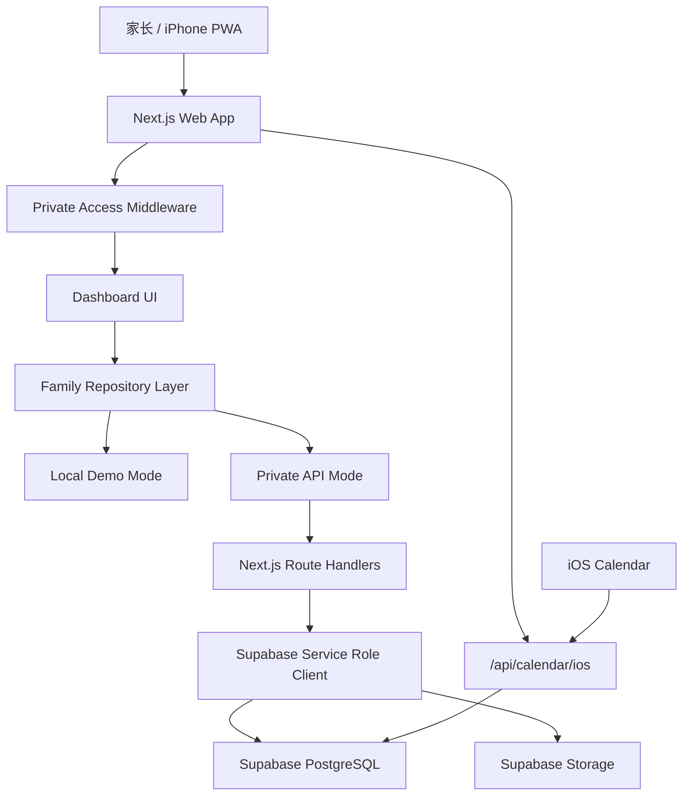
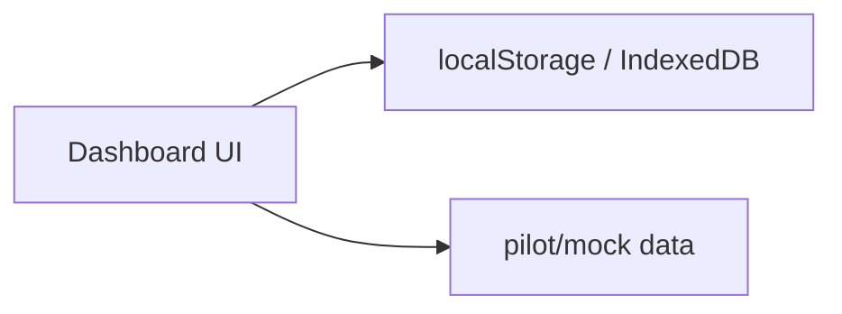
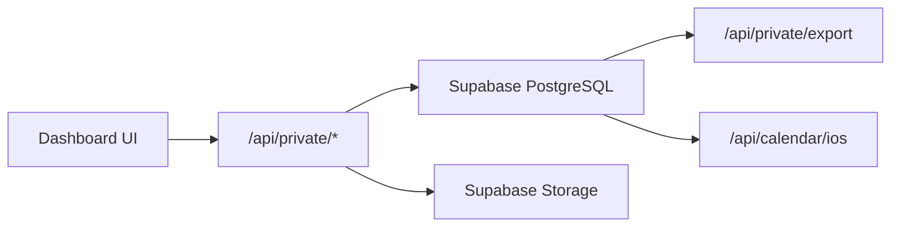
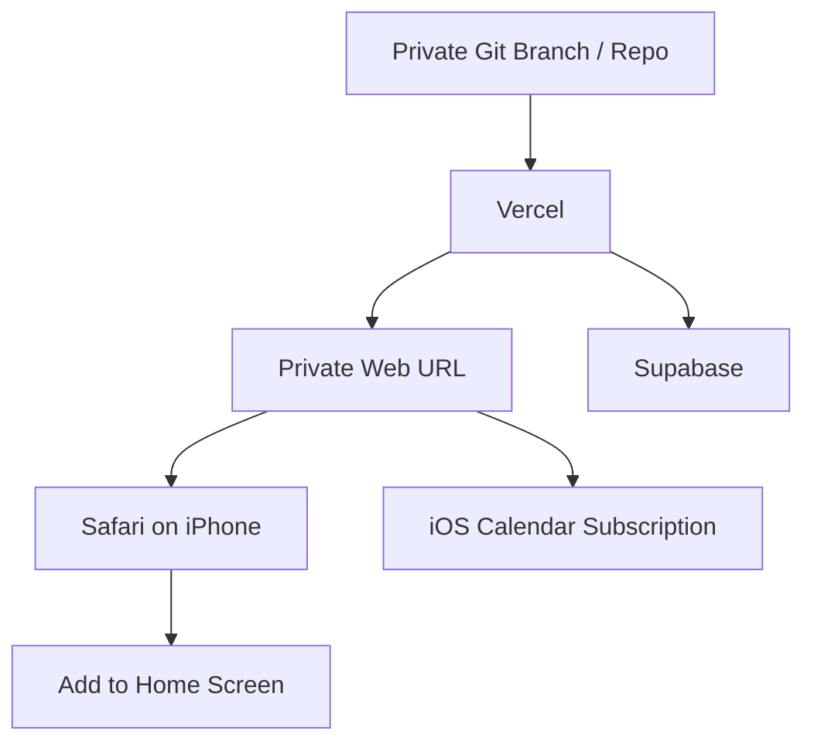

# Family Education Management System

> This README is prepared for external AI/product/engineering review.  
> Language: Chinese.  
> Project type: private customized MVP first, commercial SaaS foundation second.

## 1. 项目一句话

Family Education Management System 是一个面向多孩家庭的教育管理系统，用来统一管理孩子的学校日程、课外活动、家教反馈、考试规划、学习记录、资料文件、自我评价和长期教育路线图。

当前优先目标不是做一个泛泛的商业 SaaS，而是先交付一个可给真实家长使用的三孩家庭定制版；同时保留未来扩展成通用商业版的架构基础。

## 2. 当前业务背景

当前试点家庭有 3 个孩子：

- Child A：马上升初一
- Child B：马上升五年级
- Child C：马上升二年级

家长面临的问题：

- 三个孩子的学校、考试、课外班、家教、阅读、作业、资料散落在不同地方。
- 家长难以快速判断“今天该关注谁、下周有什么事、哪个孩子需要干预”。
- 家教老师、孩子自评、家长观察没有结构化沉淀。
- 学习资料、试卷、错题、链接、讲义缺少统一存储。
- 希望能长期使用，而不是一次性 demo。

## 3. 产品推进策略

项目分两条线：

### A. 私有定制版

目标：快速做出一个给当前三孩家庭长期使用的系统。

特点：

- 不公开到 GitHub。
- 不以复杂登录为第一优先级。
- 使用私有访问码保护页面。
- 数据进入 Supabase PostgreSQL。
- 文件进入 Supabase Storage。
- 支持 PWA，家长可在 iPhone 添加到主屏幕。
- 支持 iOS Calendar 订阅。

### B. 通用商业版

目标：后续演进成可商业化 SaaS。

特点：

- 需要正式登录、家庭 workspace、成员角色、权限体系。
- 支持任意数量孩子。
- 支持多家庭、多租户、订阅、协作、审计、导入导出。
- 适合公开 GitHub 作品集展示。

当前实现重点在 A，但架构上尽量不封死 B。

## 4. 技术栈

- Next.js 15 App Router
- React 19
- TypeScript
- TailwindCSS
- shadcn/ui 风格本地组件
- Radix UI primitives
- Supabase
- PostgreSQL
- Supabase Storage
- Vercel
- PWA / Web App Manifest
- iOS Calendar ICS feed

## 5. 当前核心模块

### 5.1 家庭总览 Dashboard

用途：让家长快速知道当前家庭教育状态。

已包含：

- 今日行动中心
- 周视图概览
- Upcoming events
- 三孩运营矩阵
- 成长摘要
- 家长行动板
- 部署状态提示

### 5.2 孩子管理

用途：管理每个孩子的基础信息和学习画像。

已包含：

- 孩子列表
- 孩子资料卡
- 年级、学校、兴趣、关注重点
- 三孩定制数据
- 未来可扩展动态 add/edit/delete

### 5.3 统一日历

用途：统一学校、家教、活动、考试、家庭事件。

已包含：

- 日程展示
- 本机新增日程
- private-api 模式下新增、编辑、删除会同步 Supabase 数据库
- 数据库写入 API
- iOS Calendar ICS 订阅接口

### 5.4 学习记录

用途：记录孩子每天/每周学习情况。

已包含：

- 学科
- 标题
- 日期
- 学习时长
- 分数
- 信心值
- 数据库写入 API

### 5.5 学习资料库

用途：长期存放试卷、讲义、错题照片、阅读资料、外部链接。

已包含：

- 学习资料索引
- 文件上传到 Supabase Storage
- 外部链接资料
- 资料元数据存入 PostgreSQL
- 下载时使用短期 signed URL

### 5.6 孩子自我评价

用途：让孩子沉淀自己的学习感受和下一步计划。

已包含：

- 心情
- 努力程度
- 信心值
- 反思
- 下一步
- 数据库写入 API

### 5.7 家教反馈

用途：让家教老师每次课后留下结构化反馈。

已包含：

- 家教老师姓名
- 科目
- 上课日期
- 时长
- 本次重点
- 孩子表现
- 作业
- 下次重点
- 评分
- 数据库写入 API

### 5.8 教育路线图

用途：管理长期目标、里程碑和考试规划。

已包含：

- 教育目标
- 目标进度
- 里程碑
- 状态
- 未来可扩展考试 timeline

### 5.9 导出中心

用途：备份、汇报、iOS 日历同步。

已包含：

- 家长周报文本
- JSON 备份
- iOS Calendar ICS 文件
- 数据库模式下优先使用 Supabase 数据库备份
- 本机模式下回退浏览器本地备份

## 6. 当前后端架构

## 7. 数据流说明

### 本机 demo 模式

适合：

- 快速展示
- 无数据库预览
- 产品框架确认

限制：

- 不能多设备同步
- 不适合作为长期数据主来源

### 私有数据库模式

适合：

- 家长长期使用
- 多设备访问
- iPhone PWA
- iOS 日历订阅
- 数据备份与迁移

## 8. 主要数据库表

私有版 Supabase schema 见：

- `docs/private-supabase-schema.sql`
- `docs/private-supabase-storage.sql`

核心表：

- `families`
- `family_settings`
- `family_members`
- `children`
- `child_intake_profiles`
- `calendar_events`
- `calendar_event_children`
- `learning_records`
- `education_goals`
- `milestones`
- `resources`
- `learning_materials`
- `self_evaluations`
- `tutor_feedback`

文件存储：

- bucket: `learning-materials`
- bucket 是 private
- 数据库保存 `storage_path`
- 下载使用短期 signed URL

## 9. API 概览

当前已接入或规划中的私有接口：

- `GET /api/private/snapshot`
- `PUT /api/private/intake`
- `POST /api/private/events`
- `PUT /api/private/events`
- `DELETE /api/private/events`
- `POST /api/private/learning-records`
- `PUT /api/private/learning-records`
- `DELETE /api/private/learning-records`
- `POST /api/private/materials`
- `PUT /api/private/materials`
- `DELETE /api/private/materials`
- `GET /api/private/self-evaluations`
- `POST /api/private/self-evaluations`
- `PUT /api/private/self-evaluations`
- `DELETE /api/private/self-evaluations`
- `GET /api/private/tutor-feedback`
- `POST /api/private/tutor-feedback`
- `PUT /api/private/tutor-feedback`
- `DELETE /api/private/tutor-feedback`
- `GET /api/private/tutor-context`
- `GET /api/private/export`
- `GET /api/calendar/ios`
- `GET /api/health`

## 10. 部署目标

目标部署方式：

家长使用方式：

1. 家长用 Safari 打开私有链接。
2. 输入访问码。
3. 添加到 iPhone 主屏幕。
4. 日常像 App 一样使用。
5. 日历可通过 `webcal://.../api/calendar/ios?token=...` 订阅到 iOS Calendar。

## 11. 当前验证状态

已通过：

- TypeScript: `npm run typecheck`
- ESLint: `npm run lint`
- 本地首页可访问
- 本地 health API 可在 local mode 下返回状态

重要环境说明：

- 当前本机系统 Node 是 v24，Next.js 15 在该环境下生产 build 可能出现 `.next/server/pages-manifest.json` 或 `next-font-manifest.json` 缺失问题。
- 项目已在 `package.json` 中声明 `engines.node = "22.x"`，并新增 `.nvmrc`，建议本地和 Vercel 使用 Node 22 LTS。

## 12. 当前已知问题 / 风险

### 12.1 UI 仍需继续优化

当前 UI 已可用，但还不够接近 Apple Education / Linear / Notion / Stripe Dashboard 的成熟质感。

需要重点优化：

- 信息密度
- 移动端实际使用路径
- 卡片层级
- 表单体验
- 空状态
- 长期数据增长后的可读性

### 12.2 登录体系尚未完整商业化

私有版优先采用访问码，适合当前家庭。

商业版仍需要：

- Supabase Auth
- family workspace membership
- owner / parent / tutor / child roles
- RLS 与应用权限一致性

### 12.3 数据恢复已有最小脚本，但还不是完整灾备

当前 `GET /api/private/export` 可以导出数据库元数据备份。
当前 `npm run private:restore -- --file ./backup.json` 可以把导出的数据库 metadata upsert 回 Supabase。

仍未实现：

- 文件本体批量导出
- 文件本体迁移
- 版本化 migration restore

### 12.4 家教/孩子协作权限需要产品设计

未来如果让家教老师或孩子自己填写，需要明确：

- 是否给每个老师独立账号
- 老师只能看一个孩子还是多个孩子
- 孩子自评是否对家长完全可见
- 家教反馈是否支持家长确认

### 12.5 通用版与定制版边界需要继续拆清

目前代码在一个项目中同时承载：

- 三孩私有定制版
- 通用商业版基础

未来可能需要：

- 分支隔离
- feature flag
- tenant config
- seed/template system
- 更清晰的数据 repository 抽象

## 13. 希望 Claude 重点分析的问题

请从 senior product architect / full-stack engineer 角度评审：

1. 当前“私有定制版优先、商业版后续抽象”的策略是否合理？
2. 当前数据库 schema 是否适合长期稳定使用？
3. 私有访问码 + PWA + Supabase 的方案，对家长日常使用是否比原生 App 更合适？
4. 当前模块是否过多？明天给家长看的 MVP 应该保留哪些，隐藏哪些？
5. 学习资料库、自评、家教反馈这三个模块的数据结构是否足够长期扩展？
6. iOS Calendar 同步方案是否应该继续使用 ICS/webcal，还是后续考虑 CalDAV/Google Calendar？
7. 如果未来商业化，应该如何拆分私有版和 SaaS 版代码？
8. 当前架构中最大的技术债是什么？
9. 哪些功能必须在真实家长使用前完成，哪些可以后置？
10. UI/UX 上最应该优先优化哪 3 个区域？

## 14. 当前建议的下一步

短期，优先服务真实家长试用：

1. 切换本地和部署环境到 Node 22 LTS，并执行 `nvm use`。
2. 配好 Supabase project、schema、storage bucket、seed。
3. 配好 Vercel env。
4. 跑通 private-api 模式。
5. 验证 iPhone PWA 添加主屏幕。
6. 验证 iOS Calendar 订阅。
7. 优化首页信息层级，让家长一眼知道“今天该做什么”。
8. 隐藏或弱化不成熟模块，避免家长第一次使用时被功能淹没。

中期，形成长期系统：

1. 补齐孩子档案、教育路线图等低频模块的完整 CRUD。
2. 数据恢复。
3. 将家教轻量提交入口扩展为按老师/孩子授权。
4. 月报生成。
5. 搜索和资料分类。
6. 权限与审计。

长期，走向商业化：

1. 多家庭 workspace。
2. 正式登录和角色。
3. 订阅计费。
4. 模板化 onboarding。
5. AI 周报/月报/学习建议。
6. 通用版公开 GitHub portfolio。
