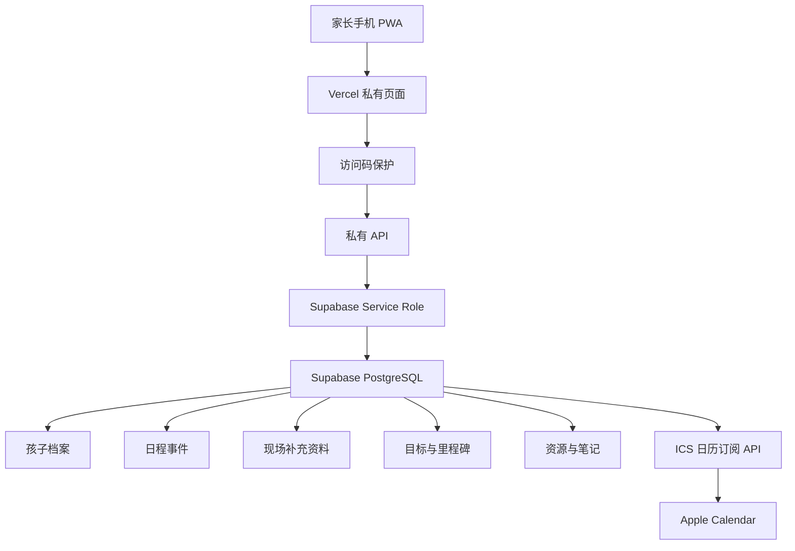

# 伯仲叔教育管理 Demo 说明

> 这是伯仲叔特制版的现场 demo 指南。当前版本定位为私有 PWA Web App，不是公开网站，也不要求家长登录。

## Demo 目标

今天 demo 要让家长清楚三件事：

1. 这个系统能集中管理伯杨、仲杨、叔杨三个人的教育事项。
2. 家长可以现场补学校、课表、重要日期、目标和关注点。
3. 后续可以变成一个私有手机 App 入口，长期用来管理日程、周报和 iOS 日历同步。

## 当前 Demo 形态

- 类型：私有 PWA Web App
- 使用方式：浏览器打开，本地 demo 地址由开发机提供
- 未来正式分享：Vercel 私有链接 + 访问码
- 家长登录：伯仲叔版不需要登录
- 长期数据：未来接 Supabase 云端数据库
- 手机入口：iPhone Safari 添加到主屏幕

## Demo 地址

本地运行后打开：

```text
http://127.0.0.1:3000
```

如果要给家长长期使用，后续会替换为类似：

```text
https://boyang-family-dashboard.vercel.app
```

## 推荐演示顺序

### 1. 家庭总览

先展示首页上方：

- 本周事项
- 学习记录
- 教育目标
- 孩子档案数量

说明这个系统不是单个孩子的学习表，而是三孩家庭的教育管理中枢。

### 2. 手机桌面私有 App

展示“手机桌面私有 App”区域。

说明：

- 家长不用去 App Store 下载。
- 用 iPhone Safari 打开私有链接。
- 输入访问码。
- 点击分享按钮，选择“添加到主屏幕”。
- 以后从手机桌面图标进入。

### 3. 家长版周报

展示“家长版周报预览”。

可操作：

- 复制摘要
- 打印 / 存 PDF
- 截图给家长

作用：

- 现场快速让家长理解三个孩子当前状态。
- 会后可以作为家庭教育沟通材料。

### 4. 家长现场补充工作台

这是今天最关键区域。

每个孩子补这些信息：

- 学校 / 班级 / 课程体系
- 固定周课表
- 近期重要日期
- 阶段目标
- 家长最关心的问题

当前本机 demo 会先存在浏览器本地。长期版会接 Supabase。

### 5. 日程编辑器

现场新增一个真实日程，例如：

```text
伯杨 初一衔接数学课
类型：辅导
时间：下周一 19:00
关联孩子：伯杨
```

新增后确认：

- 进入本周总览
- 进入统一日历
- 可进入当前页面 ICS 导出

### 6. iOS 日历同步

展示“iOS 日历同步”。

今天可用：

- 下载当前页面 ICS
- 导入 Apple Calendar

长期可用：

- 私有部署后使用订阅链接
- 家长日程更新后，iOS 日历同步刷新

## 家长如何日常使用

正式版建议这样给家长：

```text
伯仲叔教育管理：
<私有链接>

访问码：
<访问码>
```

家长第一次：

1. Safari 打开链接。
2. 输入访问码。
3. 添加到主屏幕。
4. 之后从桌面图标进入。

日常使用：

- 新增课表和考试
- 更新每个孩子目标
- 查看本周安排
- 生成周报
- 同步 iOS 日历

## 后端长期使用方案



## 数据库稳定性

长期版数据库已经按这些原则设计：

- UUID 主键
- RLS 权限
- 访问码和日历 token 分离
- `updated_at` 数据库自动维护
- 日程时间约束
- 学习分数约束
- iOS 日历订阅 token
- seed 模板可重复执行

核心文件：

- `docs/private-supabase-schema.sql`
- `docs/private-pilot-seed-template.sql`
- `docs/private-pwa-deployment-guide.md`

## 今天不做什么

今天不要展开这些：

- 大众商业版权限体系
- 原生 iOS App
- 微信小程序
- 多家庭 SaaS
- 复杂 AI 分析

今天只保证：

- 家长看得懂
- 家长能补信息
- 你能展示系统价值
- 后续能私有部署长期使用

## Demo 前检查

运行：

```bash
npm run typecheck
npm run lint
npm run build
```

生产路由检查：

```text
/
/manifest.webmanifest
/api/health
/api/calendar/ios
```

## 会后下一步

1. 整理现场补充资料。
2. 决定是否部署私有 Vercel 链接。
3. 创建 Supabase 项目。
4. 运行 schema 和 seed。
5. 配置访问码和日历 token。
6. 把私有 PWA 链接发给家长。
