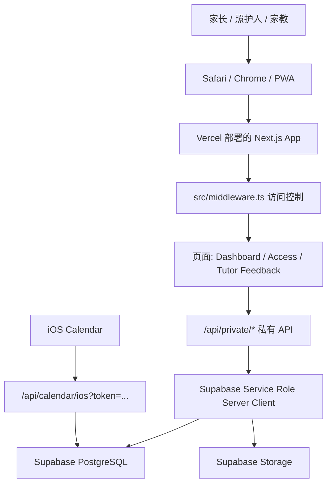
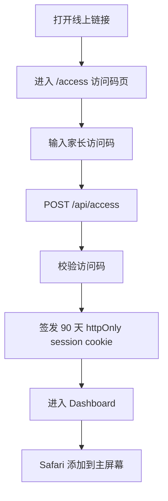
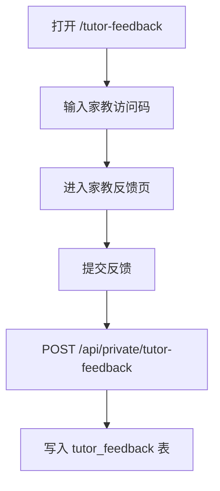
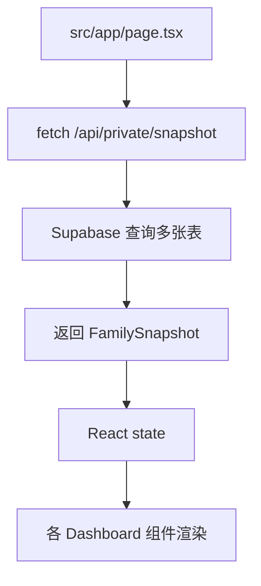
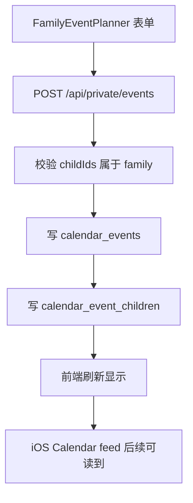
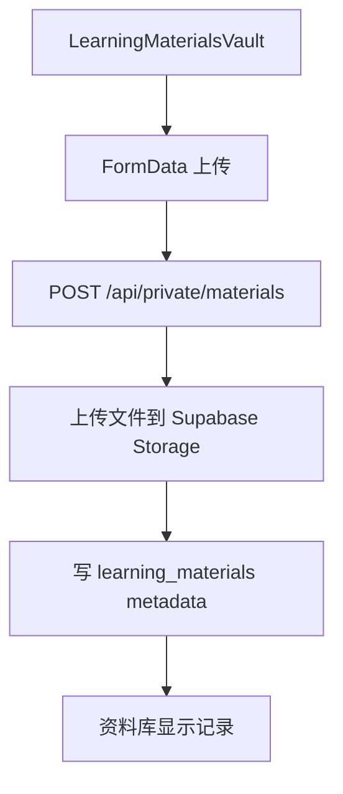

# Family Education Management System 私用版产品代码结构总图

> 目标：让非技术负责人也能理解这个产品每一步用了什么方法、代码在哪里、最终效果是什么。

当前线上地址：

```text
https://family-education-private-three-chil.vercel.app
```

当前 GitHub 私有仓库：

```text
https://github.com/moirahoumiki/family-education-private-three-child
```

当前分支：

```text
codex/private-three-child-pilot
```

## 1. 一句话理解这个系统

这是一个给单个三孩家庭长期使用的私有教育管理系统。

它不是本地 demo，而是：

- 页面部署在 Vercel
- 数据存在 Supabase PostgreSQL
- 学习资料文件存在 Supabase Storage
- 家长通过访问码进入
- 家教通过独立访问码进入反馈页
- iPhone 可以添加到主屏幕，当作网页 App 使用
- iOS Calendar 可以订阅系统日程

## 2. 当前产品完成状态

| 模块 | 状态 | 方法 | 效果 |
| --- | --- | --- | --- |
| 私有访问码 | 已完成 | Next.js API + 签名 httpOnly cookie | 家长输入访问码后 90 天内可直接进入 |
| 三孩工作台 | 已完成基础版 | Next.js 页面 + React 组件 | 家长能看今天、本周、记录、更多 |
| 孩子档案 | 已完成基础 CRUD | API route 写 Supabase | 可新增、编辑、删除无关联数据的孩子 |
| 日程管理 | 已完成 CRUD | calendar_events + calendar_event_children | 可添加学校、家教、活动、考试、家庭事项 |
| 学习记录 | 已完成 CRUD | learning_records | 可记录学习内容、时长、分数、信心 |
| 教育路线图 | 已完成 CRUD | education_goals + milestones | 可规划目标、里程碑、进度 |
| 学习资料库 | 已完成基础版 | learning_materials + Supabase Storage | 可上传/记录资料，文件长期存储 |
| 孩子自评 | 已完成 CRUD | self_evaluations | 孩子可记录心情、投入、掌握和反思 |
| 家教反馈 | 已完成基础版 | tutor_feedback + 独立家教入口 | 家教可提交反馈，但不能进入完整系统 |
| iOS 日历 | 已完成 | ICS feed + calendar token | iPhone Calendar 可订阅系统日程 |
| PWA 手机入口 | 已完成 | manifest + service worker | iPhone 可添加到主屏幕，像 App 打开 |
| 备份恢复 | 已完成脚本版 | export API + 一键 backup + restore dry-run + checksum | 可导出数据库，备份和恢复 Storage 文件 |
| 生产安全加固 | 已完成当前轮 | 签名 session、health 降敏、日历 token、关联表收紧 | 线上私有数据边界更稳 |
| UI 精修 | 待继续 | 继续优化组件和移动端表单 | 让家长日常使用更轻松 |

## 3. 整体技术路线



方法：

- 前端用 Next.js + React 做界面。
- 后端用 Next.js API Routes 做接口。
- 数据库用 Supabase PostgreSQL。
- 文件用 Supabase Storage。
- 部署用 Vercel。
- 手机 App 体验用 PWA，而不是原生 App。

效果：

- 家长不需要安装 App Store 应用。
- 只需要打开链接、输入访问码、添加到主屏幕。
- 后续更新代码后，家长不用重新安装。

## 4. 用户使用流程

### 4.1 家长第一次使用



涉及文件：

- `src/app/access/page.tsx`
- `src/app/api/access/route.ts`
- `src/lib/private-access.ts`
- `src/middleware.ts`
- `src/app/page.tsx`
- `src/components/dashboard/app-shell.tsx`
- `src/components/dashboard/pwa-install-card.tsx`

方法：

- 访问码不放在 URL。
- 登录后保存签名 cookie。
- cookie 有效期 90 天。

效果：

- 家长大约 90 天内不用重复输入访问码。
- 手机桌面图标打开后像 App 一样进入。

### 4.2 家教使用



涉及文件：

- `src/app/tutor-feedback/page.tsx`
- `src/app/api/private/tutor-context/route.ts`
- `src/app/api/private/tutor-feedback/route.ts`
- `src/middleware.ts`

方法：

- 家教角色只能访问有限接口。
- middleware 限制 tutor 不能进入完整 dashboard。
- export 和完整列表对 tutor 拒绝。

效果：

- 家教能提交课后反馈。
- 家教看不到完整家庭数据。

## 5. 页面和组件结构

### 5.1 App 主入口

| 文件 | 作用 | 效果 |
| --- | --- | --- |
| `src/app/layout.tsx` | App 全局外壳 | 注册字体、metadata、service worker |
| `src/app/page.tsx` | 主 Dashboard 页面 | 根据 activeMode 显示今天/本周/记录/更多 |
| `src/app/access/page.tsx` | 访问码页面 | 家长/家教输入访问码 |
| `src/app/tutor-feedback/page.tsx` | 家教反馈独立页面 | 家教不进 dashboard 也能提交反馈 |
| `src/app/globals.css` | 全局样式 | Tailwind 主题、颜色、基础 UI |

### 5.2 Dashboard 四个模式

主页面 `src/app/page.tsx` 控制四个模式：

| 模式 | 组件 | 家长看到的效果 |
| --- | --- | --- |
| Today | `TodayCommandCenter`、`MetricCard`、`ThreeChildOperatingMatrix` | 今天要做什么、快速入口、三个孩子状态 |
| Week | `FamilyEventPlanner`、`WeeklyOverview`、`UpcomingEvents`、`UnifiedCalendar`、`CalendarSyncCard`、`WeeklyFamilyReport` | 本周日程、添加事件、日历订阅 |
| Records | `LearningRecordPlanner`、`LearningMaterialsVault`、`SelfEvaluationBoard`、`TutorFeedbackBoard`、`ChildProfile`、`ChildManagement`、`GrowthSummary`、`EducationRoadmap`、`ResourceCenter` | 学习记录、资料、自评、家教反馈、孩子档案、路线图 |
| More | `FamilyIntakeWorkspace`、`ExportPreviewCenter`、`ParentActionBoard`、`ParentHandoffPlan`、`DeploymentStatusCard`、`PwaInstallCard` | 补资料、导出、交接计划、部署状态、手机安装 |

方法：

- 用 `activeMode` 切换内容，而不是把所有模块堆成一个超长页面。
- 桌面端用左侧 sidebar。
- 手机端用底部 tab bar。

效果：

- 家长手机上不会被 20 多个模块淹没。
- 日常打开先看“今天”，需要编辑时再进入对应模式。

## 6. 前端组件文件说明

| 文件 | 方法 | 效果 |
| --- | --- | --- |
| `src/components/dashboard/app-shell.tsx` | 桌面 sidebar + 手机底部 tab | 提供 App 框架 |
| `src/components/dashboard/today-command-center.tsx` | 紧急度排序 + 孩子颜色点 | 家长第一屏知道先做什么 |
| `src/components/dashboard/family-event-planner.tsx` | 表单 + API 保存日程 | 添加/编辑家庭教育事项 |
| `src/components/dashboard/unified-calendar.tsx` | 日程分组展示 | 统一看学校/活动/考试/家教 |
| `src/components/dashboard/calendar-sync-card.tsx` | 读取私有 calendar-link | 生成可长期订阅的 iOS webcal 链接 |
| `src/components/dashboard/learning-record-planner.tsx` | 学习记录表单 | 记录学习内容和表现 |
| `src/components/dashboard/learning-materials-vault.tsx` | FormData 上传 + Storage metadata | 存储学习资料文件 |
| `src/components/dashboard/self-evaluation-board.tsx` | 自评表单 | 孩子记录反思和下一步 |
| `src/components/dashboard/tutor-feedback-board.tsx` | 家教反馈管理 | 家长看反馈、补充反馈 |
| `src/components/dashboard/child-management.tsx` | 孩子 CRUD | 管理孩子档案 |
| `src/components/dashboard/education-roadmap.tsx` | 目标和里程碑 CRUD | 长期规划 |
| `src/components/dashboard/export-preview-center.tsx` | 调用 export API | 查看导出数据效果 |
| `src/components/dashboard/pwa-install-card.tsx` | PWA 安装说明 | 指导添加到主屏幕 |
| `src/components/dashboard/deployment-status-card.tsx` | 调用 health API | 看部署环境是否 ready |

## 7. UI 基础组件

目录：

```text
src/components/ui/
```

文件：

- `button.tsx`
- `card.tsx`
- `input.tsx`
- `textarea.tsx`
- `select.tsx`
- `tabs.tsx`
- `badge.tsx`
- `dialog.tsx`
- `avatar.tsx`
- `progress.tsx`
- `separator.tsx`
- `label.tsx`

方法：

- 采用 shadcn/ui 风格的本地组件。
- 不依赖远程 UI 服务。
- 统一按钮、卡片、输入框、徽章的视觉风格。

效果：

- 后续 UI 优化可以集中改这些基础组件。
- 不同模块看起来更统一。

## 8. 后端 API 结构

目录：

```text
src/app/api/
```

### 8.1 公共/半公共 API

| 文件 | 方法 | 效果 |
| --- | --- | --- |
| `api/access/route.ts` | 校验访问码，签发 cookie | 登录入口 |
| `api/health/route.ts` | 检查 env 和部署状态 | 判断线上是否 ready |
| `api/calendar/ios/route.ts` | 根据 token 或已登录 session 输出 ICS | iOS Calendar 订阅，未授权不返回私有/演示日历 |

### 8.2 私有 API

目录：

```text
src/app/api/private/
```

| 文件 | 数据表 | 方法 | 效果 |
| --- | --- | --- | --- |
| `_utils.ts` | 通用 | familyId、Supabase client、孩子归属校验 | 避免重复安全逻辑 |
| `snapshot/route.ts` | 多张表 | 读取 dashboard 初始数据 | 页面加载真实数据 |
| `children/route.ts` | children | 新增/编辑/删除孩子 | 管理孩子档案 |
| `events/route.ts` | calendar_events、calendar_event_children | 新增/编辑/删除日程 | 管理日程 |
| `learning-records/route.ts` | learning_records | 新增/编辑/删除学习记录 | 持久化学习记录 |
| `materials/route.ts` | learning_materials + Storage | 上传文件/链接/编辑/删除 | 存储资料 |
| `self-evaluations/route.ts` | self_evaluations | 新增/编辑/删除自评 | 记录孩子自我评价 |
| `tutor-feedback/route.ts` | tutor_feedback | 新增/编辑/删除反馈 | 记录家教反馈 |
| `tutor-context/route.ts` | children | 给家教页返回最小孩子列表 | 家教只拿必要数据 |
| `roadmap/route.ts` | education_goals、milestones | 目标和里程碑 CRUD | 教育路线图 |
| `intake/route.ts` | child_intake_profiles | 家长现场补资料 | 初次访谈/家长补充信息 |
| `calendar-link/route.ts` | family_settings | 给登录家长返回带 token 的 webcal URL | iOS 长期订阅可用 |
| `export/route.ts` | 13 张表 | 导出 JSON 备份 | 灾难恢复基础 |

方法：

- 所有写入通过服务端 API 进入 Supabase。
- `SUPABASE_SERVICE_ROLE_KEY` 只在服务端使用。
- 多数写入先校验 childId 是否属于当前 family。
- `snapshot/route.ts` 先读取本家庭 event/goal，再按 id 读取关联表，避免未来多家庭时关联数据串读。

效果：

- 客户端看不到 service role key。
- 数据不会只停在浏览器本地。
- 后续换手机/电脑仍然可以看到同一套数据。

## 9. 访问控制和安全

### 9.1 Middleware

文件：

```text
src/middleware.ts
```

方法：

- 拦截受保护页面。
- 检查 `family_private_session` cookie。
- parent/caregiver 可以进完整 dashboard。
- tutor 只能进 `/tutor-feedback` 和有限 API。
- 未授权访问 `/api/private/*` 返回 JSON 403。

效果：

- 家长数据不会直接暴露在公开 URL。
- 家教不会看到完整家庭工作台。
- 未登录访问私有 API 得到 JSON 403，不会被重定向到 HTML 页面。

### 9.2 访问码和 session

文件：

```text
src/lib/private-access.ts
```

方法：

- 访问码来自 Vercel 环境变量。
- 成功登录后创建 HMAC 签名 session。
- cookie 是 httpOnly、SameSite=Strict。
- 有效期现在是 90 天。
- 生产环境要求 `PRIVATE_SESSION_SECRET` 至少 32 字符。
- 旧版明文 role/access cookie 已移除，不再作为 fallback。

效果：

- 家长手机添加到主屏幕后，不需要每天重新登录。
- 如果访问码泄露，可以轮换 Vercel env 并重新部署。
- 公开 `/api/health` 只返回 `{ ok: true }`，详细环境检查必须登录后才能看到。

## 10. 数据模型

核心类型：

```text
src/lib/types.ts
src/lib/core-types.ts
```

主要类型：

- `Child`
- `CalendarEvent`
- `LearningRecord`
- `EducationGoal`
- `Resource`
- `LearningMaterial`
- `SelfEvaluation`
- `TutorFeedback`
- `FamilySnapshot`

效果：

- 前端组件、API 和 Supabase 映射更清晰。
- 后续扩展商业版时有统一数据语言。

## 11. Supabase 数据库

SQL 文件：

```text
docs/private-supabase-schema.sql
docs/private-supabase-storage.sql
docs/private-pilot-seed-template.sql
```

### 11.1 表结构

| 表 | 存什么 |
| --- | --- |
| `families` | 家庭工作区 |
| `family_settings` | 日历 token、时区、日历名 |
| `children` | 孩子档案 |
| `child_intake_profiles` | 家长补充资料 |
| `calendar_events` | 日程主体 |
| `calendar_event_children` | 日程和孩子的多对多关系 |
| `learning_records` | 学习记录 |
| `education_goals` | 教育目标 |
| `milestones` | 目标里程碑 |
| `resources` | 资源中心旧模型 |
| `learning_materials` | 学习资料元数据 |
| `self_evaluations` | 孩子自评 |
| `tutor_feedback` | 家教反馈 |

### 11.2 Storage

文件：

```text
docs/private-supabase-storage.sql
```

方法：

- 建立私有 bucket：`learning-materials`
- 文件本体进 Storage
- 数据库只存 `storage_path` 和 metadata

效果：

- PDF、图片、资料不会塞进数据库。
- 以后可以生成短期 signed URL 下载。

## 12. 数据读取和写入流程

### 12.1 页面加载



效果：

- 家长打开页面时看到 Supabase 里的真实数据。

### 12.2 添加日程



效果：

- 家长新增日程后，系统和 iOS 订阅源都能看到。

### 12.3 上传学习资料



效果：

- 文件长期存在云端，而不是只在当前手机里。

## 13. iOS Calendar 方案

文件：

- `src/app/api/calendar/ios/route.ts`
- `src/app/api/private/calendar-link/route.ts`
- `src/lib/ics.ts`
- `src/lib/supabase-calendar-feed.ts`
- `src/components/dashboard/calendar-sync-card.tsx`

方法：

- `family_settings.calendar_token` 是独立日历 token。
- 登录家长通过 `/api/private/calendar-link` 获取带 token 的 webcal 链接。
- iOS Calendar 访问 `/api/calendar/ios?token=...`。
- API 输出标准 ICS 文本。
- 私有生产模式下，如果没有 token 且没有有效登录 session，`/api/calendar/ios` 返回 401。
- token 校验和按家庭读取日历都在服务端使用 Supabase admin client 完成。

效果：

- 家长可在 iPhone Calendar 订阅系统日程。
- 这是单向同步：系统 → iOS Calendar。
- 不支持在 iOS Calendar 修改后反向写回系统。
- 不再公开返回 pilot/demo 日历，避免无 token 地址泄露样例数据。

为什么这样做：

- CalDAV 双向同步复杂度高。
- 私用家庭场景先用 ICS/webcal 性价比最高。

## 14. PWA 手机 App 方案

文件：

- `src/app/manifest.ts`
- `src/app/icon.tsx`
- `src/app/apple-icon.tsx`
- `public/sw.js`
- `public/offline.html`
- `src/components/system/service-worker-register.tsx`
- `src/components/dashboard/pwa-install-card.tsx`

方法：

- 提供 Web App Manifest。
- 提供 Apple icon。
- 注册 service worker。
- iPhone Safari 支持添加到主屏幕。

效果：

- 家长手机桌面有一个图标。
- 打开效果接近 App。
- 不需要 App Store 审核。
- 更新系统只需要重新部署 Vercel。

## 15. 部署结构

### 15.1 GitHub

私有仓库：

```text
moirahoumiki/family-education-private-three-child
```

当前分支：

```text
codex/private-three-child-pilot
```

方法：

- 私用版不放公开仓库。
- 公开商业版以后单独处理。

效果：

- 伯仲叔定制版不会公开暴露。

### 15.2 Vercel

项目：

```text
family-education-private-three-child
```

生产 URL：

```text
https://family-education-private-three-chil.vercel.app
```

方法：

- Vercel 连接项目。
- 手动导入 `.env.local` 环境变量。
- `npx vercel --prod --yes` 部署。

效果：

- 家长可以用公网链接访问。
- 更新代码后重新部署即可。

### 15.3 环境变量

文档：

```text
docs/private-vercel-env-checklist.md
```

主要变量：

- `NEXT_PUBLIC_FAMILY_DATA_MODE`
- `NEXT_PUBLIC_SUPABASE_URL`
- `NEXT_PUBLIC_SUPABASE_ANON_KEY`
- `NEXT_PUBLIC_PRIVATE_FAMILY_ID`
- `SUPABASE_SERVICE_ROLE_KEY`
- `PRIVATE_PARENT_ACCESS_CODE`
- `PRIVATE_CAREGIVER_ACCESS_CODE`
- `PRIVATE_TUTOR_ACCESS_CODE`
- `PRIVATE_VIEWER_ACCESS_CODE`
- `PRIVATE_SESSION_SECRET`
- `SUPABASE_LEARNING_MATERIALS_BUCKET`

效果：

- 本地和 Vercel 使用同一套配置。
- 密钥不进入 GitHub。

## 16. 备份和恢复

脚本：

| 文件 | 方法 | 效果 |
| --- | --- | --- |
| `scripts/private-backup-all.mjs` | 登录生产站点导出 JSON，并下载 Storage 文件 | 一键生成完整备份目录 |
| `scripts/private-backup-storage.mjs` | 下载 Supabase Storage 文件 | 备份资料文件本体 |
| `scripts/private-restore-storage.mjs` | 上传文件回 Storage | 恢复资料文件 |
| `scripts/private-restore-backup.mjs` | upsert 数据库 JSON | 恢复数据库元数据 |
| `src/app/api/private/export/route.ts` | 导出 13 张表 JSON | 生成数据库备份 |

推荐备份流程：

```bash
npm run private:backup -- --out ./private-backups/latest
```

这个命令会生成：

- `database-export.json`
- `storage/storage-manifest.json`
- `storage/files/**`
- `backup-manifest.json`

恢复前 dry run：

```bash
npm run private:restore -- \
  --file ./private-backups/latest/database-export.json \
  --storage-manifest ./private-backups/latest/storage/storage-manifest.json \
  --dry-run

npm run private:restore-storage -- --dir ./private-backups/latest/storage --dry-run
```

效果：

- 将来如果 Supabase 项目出问题，可以迁移到新项目。
- 不只是导出文字，也能备份文件。
- Storage 备份带 SHA-256 checksum，恢复前能发现文件损坏或 metadata 对不上。

## 17. 验证和质量检查

本地检查：

```bash
npm run typecheck
npm run lint
npm run build
```

线上 smoke：

```bash
npm run private:smoke -- \
  --base-url https://family-education-private-three-chil.vercel.app \
  --expect-ready \
  --deep-private
```

已验证通过：

- health ready
- access page
- manifest/icons/service worker/offline page
- 访问码登录
- 未登录 API 拒绝
- dashboard
- tutor 权限边界
- calendar feed
- private export
- calendar-link 返回带 token 的 webcal URL
- session cookie 有效期 90 天
- 公开 health 降敏，登录后 health 才返回详细 ready 信息
- 未登录、无 token 的生产日历入口不再返回 demo 日历

## 18. 现阶段你应该怎么理解它

这个系统现在可以分成三层：

### 第一层：用户入口

- 家长：PWA dashboard
- 家教：`/tutor-feedback`
- iOS Calendar：webcal 订阅

### 第二层：业务系统

- 日程
- 学习记录
- 资料库
- 自评
- 家教反馈
- 孩子档案
- 教育路线图

### 第三层：云端基础设施

- Vercel：网页部署
- Supabase PostgreSQL：结构化数据
- Supabase Storage：文件
- GitHub private repo：代码

## 19. 现在还没做完的东西

这些不是“不能用”，而是后续打磨项：

| 项目 | 为什么要做 |
| --- | --- |
| 手机端表单精简 | 家长日常录入要更快 |
| UI 美化 | 现在能用，但还不够高级、轻盈 |
| 自动备份 | 现在是手动脚本，长期建议自动化 |
| 更细权限 | 未来每个家教只看自己的孩子/科目 |
| 共享限流 | 现在仍是 cookie/内存级保护，Vercel 多实例建议接 Upstash Redis |
| 错误监控 | 线上出错时自动提醒 |
| 自定义域名 | 给家长更好看的链接 |
| 月度报告 | 把记录沉淀成家长可读的成长报告 |
| 商业版拆分 | 多家庭、多账号、付费订阅 |

## 20. 最重要的文件速查

如果你只记十个文件，记这些：

| 文件 | 为什么重要 |
| --- | --- |
| `README.md` | 项目总说明 |
| `src/app/page.tsx` | 主 dashboard |
| `src/components/dashboard/app-shell.tsx` | 桌面/手机 App 框架 |
| `src/middleware.ts` | 权限守门 |
| `src/lib/private-access.ts` | 访问码和 90 天登录 |
| `src/app/api/private/_utils.ts` | 私有 API 通用安全逻辑 |
| `docs/private-supabase-schema.sql` | 数据库结构 |
| `docs/private-supabase-vercel-runbook.md` | 部署流程 |
| `docs/private-vercel-env-checklist.md` | Vercel 环境变量清单 |
| `scripts/private-smoke-test.mjs` | 线上验收脚本 |

## 21. 后续推荐推进顺序

1. 手机端真实使用 1-2 天，记录卡点。
2. 优化 Today 首页和 Records 表单。
3. 做家长交付说明。
4. 做 iOS 日历订阅最终验收。
5. 做备份演练。
6. 再考虑 UI 高级化和月度报告。

当前判断：

```text
工程地基：已完成
线上部署：已完成
手机入口：已完成
长期登录：已完成
真实家庭交付：可以开始小范围试用
UI 和细节：继续打磨
```
