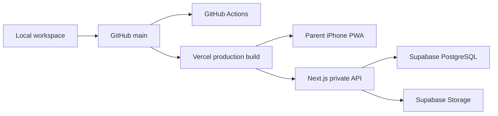

# Private Production Runbook

Current hosting and operations runbook for the private three-child Family Education Management System.

Do not put access codes, Supabase keys, calendar tokens, or `.env.local` contents in this file.

## Canonical Services

| Layer | Service | Canonical target |
| --- | --- | --- |
| Source | GitHub private repository | `moirakk/family-education-private-three-child` |
| Production web app | Vercel | `https://family-education-private-three-chil.vercel.app` |
| Database | Supabase PostgreSQL | private family project, `ap-northeast-1` |
| File storage | Supabase Storage | private `learning-materials` bucket |

Parents should receive only the canonical Vercel URL above. Deployment-specific URLs may be used for engineering verification, but should not be installed on family devices unless they have passed the same acceptance checklist.

## Deployment Flow



Normal release:

1. Use Node.js 22, matching `package.json`.
2. Run local quality gates.
3. Commit and push to GitHub.
4. Confirm GitHub Actions is green.
5. Deploy to Vercel Production.
6. Run smoke checks against the production URL.
7. Run the mobile acceptance checklist when user-facing behavior changed.

Manual production deploy:

```bash
npx vercel --prod --yes
```

## Required Vercel Environment Variables

Configure these in Vercel project environment variables. Values come from `.env.local`; never commit them.

```text
NEXT_PUBLIC_FAMILY_DATA_MODE
NEXT_PUBLIC_SUPABASE_URL
NEXT_PUBLIC_SUPABASE_ANON_KEY
SUPABASE_SERVICE_ROLE_KEY
SUPABASE_JWT_SECRET
NEXT_PUBLIC_PRIVATE_FAMILY_ID
PRIVATE_PARENT_ACCESS_CODE
PRIVATE_CAREGIVER_ACCESS_CODE
PRIVATE_TUTOR_ACCESS_CODE
PRIVATE_VIEWER_ACCESS_CODE
PRIVATE_SESSION_SECRET
SUPABASE_LEARNING_MATERIALS_BUCKET
PRIVATE_CALENDAR_TOKEN
```

Optional:

```text
PRIVATE_PARENT_ACCESS_MODE
```

Production should leave `PRIVATE_PARENT_ACCESS_MODE` unset or set to `closed`. Do not use `unsafe-open` in production.

After changing any `NEXT_PUBLIC_*` variable, trigger a new production deploy because the value is embedded at build time.

## Quality Gates

Use Node.js 22:

```bash
npm run typecheck
npm run lint
npm run test
npm run build
```

Production smoke checks:

```bash
curl -I https://family-education-private-three-chil.vercel.app/
curl -s https://family-education-private-three-chil.vercel.app/api/health
```

Expected:

- `/` returns `307` to `/access?next=%2F`
- `/api/health` returns `{"ok":true}`
- authenticated `/api/private/snapshot` returns live Supabase data

For deeper private checks, use `scripts/private-smoke-test.mjs` with a base URL and values loaded from `.env.local`. Do not paste private values into command history, documentation, screenshots, or review prompts.

## Backup And Recovery

The default full backup command targets the canonical Vercel deployment:

```bash
npm run private:backup -- --out ./private-backups/latest
```

Expected output:

```text
database-export.json
storage/storage-manifest.json
storage/files/**
backup-manifest.json
```

Dry-run restore before any real restore:

```bash
npm run private:restore -- \
  --file ./private-backups/latest/database-export.json \
  --storage-manifest ./private-backups/latest/storage/storage-manifest.json \
  --dry-run

npm run private:restore-storage -- --dir ./private-backups/latest/storage --dry-run
```

Rehearse production recovery in a fresh Supabase project before trusting the backup path.

## Incident Order

If the family reports that the app is unavailable:

1. Check whether the canonical Vercel URL opens on Wi-Fi and mobile data.
2. Check the latest Vercel deployment and function logs.
3. Check `/api/health` without exposing its output publicly.
4. Check Supabase project status and quota.
5. Check recent GitHub Actions runs and the currently deployed commit.
6. Record the incident in `docs/private-observation-log.md`.

## Related Documents

- `README.md`
- `ROADMAP.md`
- `docs/deployment-guide.md`
- `docs/private-production-handoff-and-observation.md`
- `docs/private-production-mobile-acceptance.md`
- `docs/private-observation-log.md`
