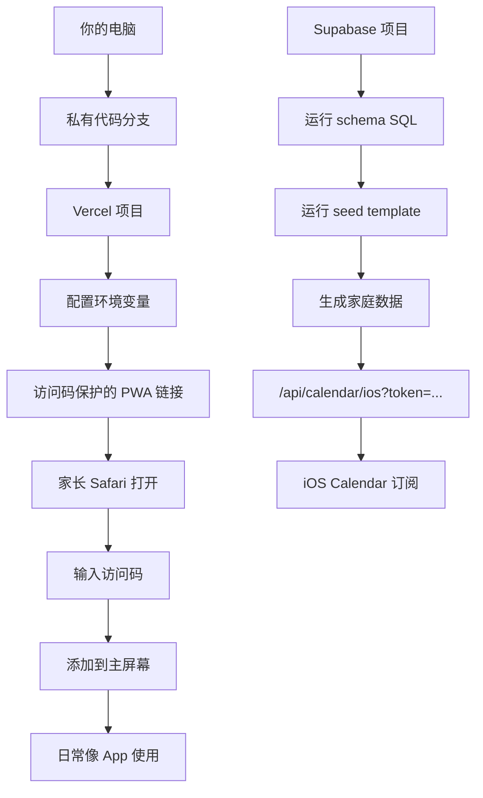

# 伯仲叔私有 PWA 交付部署指南

> 目标：把你电脑上的定制版，变成家长可打开的私有链接。

## 最终交付形态

家长拿到三样东西：

1. 私有 PWA 链接。
2. 访问码。
3. iOS 日历订阅链接。

家教老师只拿到：

1. 课后反馈链接：`/tutor-feedback`
2. 家教访问码：`PRIVATE_TUTOR_ACCESS_CODE`

```text
网页在 Vercel
数据在 Supabase
访问靠访问码
日历靠数据库 token
你的电脑只负责开发和维护
```

## 部署流程



## Vercel 环境变量

必须配置：

```text
NEXT_PUBLIC_SUPABASE_URL
NEXT_PUBLIC_SUPABASE_ANON_KEY
SUPABASE_SERVICE_ROLE_KEY
NEXT_PUBLIC_PRIVATE_FAMILY_ID
NEXT_PUBLIC_FAMILY_DATA_MODE=private-api
PRIVATE_PARENT_ACCESS_CODE
PRIVATE_CAREGIVER_ACCESS_CODE
PRIVATE_TUTOR_ACCESS_CODE
PRIVATE_VIEWER_ACCESS_CODE
```

`PRIVATE_PARENT_ACCESS_CODE` 是必须项。`PRIVATE_CAREGIVER_ACCESS_CODE`、`PRIVATE_TUTOR_ACCESS_CODE`、`PRIVATE_VIEWER_ACCESS_CODE` 可按需配置。
`PRIVATE_ACCESS_CODE` 只作为旧部署兼容项。

iOS 日历订阅 token 不再放在 Vercel env，主来源是 `family_settings.calendar_token`。
需要撤销或轮换时，更新数据库里的 `calendar_token`，旧 `webcal` 链接会失效。

本地演示可以保持：

```text
NEXT_PUBLIC_FAMILY_DATA_MODE=local
```

长期私有在线版使用：

```text
NEXT_PUBLIC_FAMILY_DATA_MODE=private-api
```

此模式下，浏览器不会直接持有 `SUPABASE_SERVICE_ROLE_KEY`。所有写入都通过 Vercel 服务端的 `/api/private/*` 接口完成。

## Supabase 步骤

1. 创建 Supabase project。
2. 打开 SQL Editor。
3. 运行 `docs/private-supabase-schema.sql`。
4. 运行 `docs/private-supabase-storage.sql`，创建 `learning-materials` 私有 bucket。
5. 创建一个家长 auth user，拿到 `auth.users.id`。
6. 复制 `docs/private-pilot-seed-template.sql`。
7. 替换 `owner_user_id`。
8. 运行 seed。
9. 把 `family_id` 设置到 Vercel 的 `NEXT_PUBLIC_PRIVATE_FAMILY_ID`。

完整联调清单见：`docs/private-supabase-vercel-runbook.md`。

## 数据库长期稳定规则

- `docs/private-supabase-schema.sql` 可以重复运行，policies 和 triggers 会先 drop 再创建。
- 不要手动修改已分配的 `family_id`、`child_id`。`calendar_token` 可以在需要撤销旧 iOS 订阅链接时轮换。
- 新增真实日程必须保证结束时间晚于开始时间。
- 分数类数据只使用 0-100。
- 学习资料文件本体放 Supabase Storage，`learning_materials` 表存索引、路径和元数据。
- 自我评价与家教反馈独立成表，避免混进普通学习记录。
- iOS 日历订阅只依赖 `family_settings.calendar_token`，不要把访问码当日历 token 使用。
- 完整 Dashboard 只允许 parent/caregiver 访问码进入；tutor/viewer code 预留给后续更窄的提交入口。
- 家教访问码只能进入 `/tutor-feedback` 课后反馈入口，不能进入完整工作台。
- 后续如果要改表结构，新增 migration 文件，不要直接覆盖已经上线数据库里的历史语义。

## 当前已接入数据库的模块

私有在线模式 `private-api` 已支持：

- `GET /api/private/snapshot`：读取家庭、孩子、日程、学习记录、目标、资源。
- `POST /api/private/children` / `PUT /api/private/children` / `DELETE /api/private/children`：新增、编辑和删除孩子档案。
- `PUT /api/private/intake`：保存家长现场补充资料。
- `POST /api/private/events` / `PUT /api/private/events` / `DELETE /api/private/events`：新增、编辑和删除日程。
- `POST /api/private/learning-records` / `PUT /api/private/learning-records` / `DELETE /api/private/learning-records`：新增、编辑和删除学习记录。
- `POST /api/private/materials` / `PUT /api/private/materials` / `DELETE /api/private/materials`：保存、编辑和删除学习资料索引。
- `GET /api/private/self-evaluations` / `POST /api/private/self-evaluations` / `PUT /api/private/self-evaluations` / `DELETE /api/private/self-evaluations`：读取、新增、编辑和删除孩子自评。
- `GET /api/private/tutor-feedback` / `POST /api/private/tutor-feedback` / `PUT /api/private/tutor-feedback` / `DELETE /api/private/tutor-feedback`：读取、新增、编辑和删除家教反馈。
- `GET /api/private/export`：导出 Supabase 数据库元数据备份，文件本体仍保留在私有 Storage。

学习资料文件本体通过 `learning-materials` 私有 Storage bucket 保存；下载时服务端生成短期 signed URL。

## 备份与恢复

导出：

```text
/api/private/export
```

恢复演练：

```bash
npm run private:restore -- --file ./family-education-database-backup.json --dry-run
```

实际恢复：

```bash
NEXT_PUBLIC_SUPABASE_URL="https://your-project.supabase.co" \
SUPABASE_SERVICE_ROLE_KEY="service-role-key" \
npm run private:restore -- --file ./family-education-database-backup.json
```

当前 restore 是数据库 metadata upsert。学习资料文件本体仍依赖 Supabase Storage 中已有对象；如果换 Supabase 项目，需要单独迁移 Storage 文件。

## 部署后自检

本地生产验证建议先清理构建产物：

```bash
npm run build:clean
```

打开：

```text
/api/health
```

确认：

```text
readyForPrivateDeploy: true
```

再检查：

```text
/manifest.webmanifest
/icon
/sw.js
/api/calendar/ios?token=<family_settings.calendar_token>
```

## 发给家长的话术

```text
这是给你们家的私有教育管理 App。

链接：
<私有链接>

访问码：
<访问码>

第一次用 iPhone Safari 打开，输入访问码后，点分享按钮，选择“添加到主屏幕”。
以后就可以像 App 一样从桌面打开。
```

## 发给家教的话术

```text
这是课后反馈提交入口，只用于填写本次课程反馈。

链接：
<私有链接>/tutor-feedback

家教访问码：
<PRIVATE_TUTOR_ACCESS_CODE>
```

## 注意

- 不把伯仲叔特制数据推到公开 GitHub。
- `SUPABASE_SERVICE_ROLE_KEY` 只能放 Vercel 服务端环境变量。
- 访问码适合伯仲叔特制版；当前完整工作台只发 parent/caregiver code。
- iOS 日历 token 泄露时，直接轮换 `family_settings.calendar_token` 并让家长重新订阅。
- 大众商业版未来再做正式登录、家庭成员权限和审计日志。
