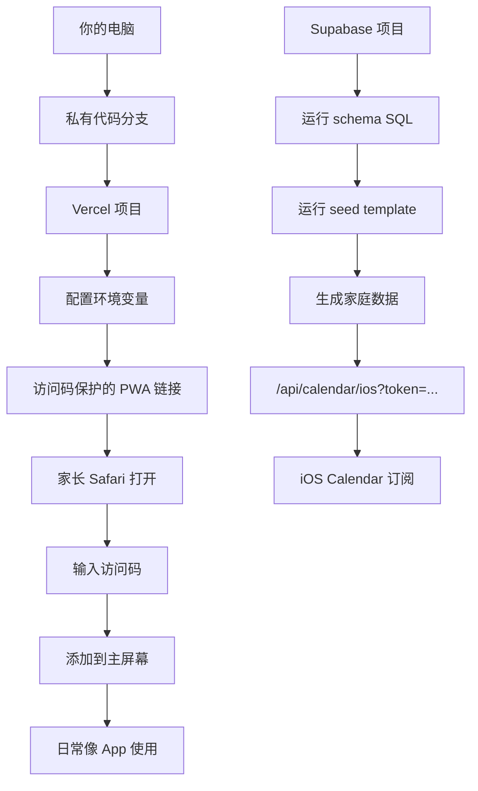

# 伯仲叔私有 PWA 交付部署指南

> 目标：把你电脑上的定制版，变成家长可打开的私有链接。

## 最终交付形态

家长拿到三样东西：

1. 私有 PWA 链接。
2. 访问码。
3. iOS 日历订阅链接。

```text
网页在 Vercel
数据在 Supabase
访问靠访问码
日历靠 token
你的电脑只负责开发和维护
```

## 部署流程



## Vercel 环境变量

必须配置：

```text
NEXT_PUBLIC_SUPABASE_URL
NEXT_PUBLIC_SUPABASE_ANON_KEY
SUPABASE_SERVICE_ROLE_KEY
NEXT_PUBLIC_PRIVATE_FAMILY_ID
NEXT_PUBLIC_FAMILY_DATA_MODE=private-api
PRIVATE_ACCESS_CODE
PRIVATE_CALENDAR_TOKEN
```

本地演示可以保持：

```text
NEXT_PUBLIC_FAMILY_DATA_MODE=local
```

## Supabase 步骤

1. 创建 Supabase project。
2. 打开 SQL Editor。
3. 运行 `docs/private-supabase-schema.sql`。
4. 创建一个家长 auth user，拿到 `auth.users.id`。
5. 复制 `docs/private-pilot-seed-template.sql`。
6. 替换 `owner_user_id`。
7. 运行 seed。
8. 把 `family_id` 设置到 Vercel 的 `NEXT_PUBLIC_PRIVATE_FAMILY_ID`。

## 部署后自检

本地生产验证建议先清理构建产物：

```bash
npm run build:clean
```

打开：

```text
/api/health
```

确认：

```text
readyForPrivateDeploy: true
```

再检查：

```text
/manifest.webmanifest
/icon
/sw.js
/api/calendar/ios?token=<PRIVATE_CALENDAR_TOKEN>
```

## 发给家长的话术

```text
这是给你们家的私有教育管理 App。

链接：
<私有链接>

访问码：
<访问码>

第一次用 iPhone Safari 打开，输入访问码后，点分享按钮，选择“添加到主屏幕”。
以后就可以像 App 一样从桌面打开。
```

## 注意

- 不把伯仲叔特制数据推到公开 GitHub。
- `SUPABASE_SERVICE_ROLE_KEY` 只能放 Vercel 服务端环境变量。
- 访问码适合伯仲叔特制版；大众商业版未来再做登录和家庭成员权限。
